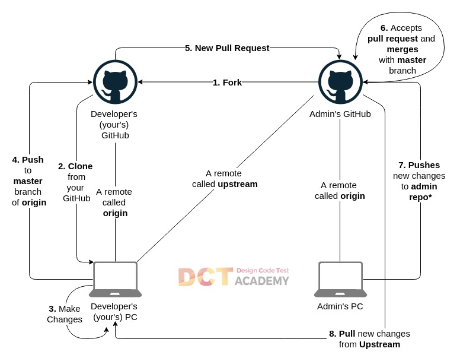

### Testowy wpis 


# #TO DO 
1. Podstawowe komendy
2. init commit push
3. czym jest master, branch, repo


# Odpalenie nowego repo 

1.  ```git init```
### #TODO sprawdzic jak ladniej opisac to dodanie wszystkich plikow  
2. Dodanie wzystkich plikow : ```git add -A``` 
3. ```git push -m "Opis commita"``` 
4. ````git remote set-url origin git@github.com:mariuszkuswik/nazwa_repo.git````
5. ```git remote add origin https://github.com/mariuszkuswik/nazwa_repo.git```
### #TODO Do sprawdzenia czym jest origin, poprawic opis 
6. master to nazwa brancha : ```git push origin master```


#  Branch


### #TODO - Dodać informację o komendach podstwowych takich jak 
- git branch 
- git checkout 


[Tworzenie nowego brancha na przykładzie](https://git-scm.com/book/en/v2/Git-Branching-Basic-Branching-and-Merging)


## Jak stworzyć nowy branch i zmergować go z mainem 

1. Tworzenie nowego brancha, przejście do niego 

```git checkout -b nazwa_brancha```
> Switched to a new branch "nowy_branch" 

2. zmiana brancha bez tworzenia nowego

```git checkout nazwa_brancha``` 

2. Wyświetlenie wszystkich branchy 

```git branch ```

> github_edycja_branchy
> main
> * nowy_branch


4. Edycja plików w obecnym (nowym) branchu 

5. Zmiana brancha na ten z którym chcemy połączyć wprowadzone zmiany 

```git checkout main```

6. Połączenie zmian wprowadzonych w nowym branchu z mainem 

```git merge nazwa_brancha```

7. Usunięcie brancha który już nie jest potrzebny 

```git branch -d nazwa_brancha"```

## Create a new branch with git and manage branches

### In your Github fork, you need to keep your master branch clean, by clean I mean without any changes, like that you can create at any time a branch from your master. Each time that you want to commit a bug or a feature, you need to create a branch for it, which will be a copy of your master branch.


When you do a pull request on a branch, you can continue to work on another branch and make another pull request on this other branch.
Before creating a new branch, pull the changes from upstream. Your master needs to be up to date.

```$ git pull```

Create the branch on your local machine and switch in this branch :

```$ git checkout -b [name_of_your_new_branch]```

Push the branch on github :

```$ git push origin [name_of_your_new_branch]```

When you want to commit something in your branch, be sure to be in your branch. Add -u parameter to set-upstream.
You can see all the branches created by using :

```$ git branch -a```

Add a new remote for your branch :

```$ git remote add [name_of_your_remote] [name_of_your_new_branch]```

Push changes from your commit into your branch :

```$ git push [name_of_your_new_remote] [url]```

Update your branch when the original branch from official repository has been updated :

```$ git fetch [name_of_your_remote]```

Then you need to apply to merge changes if your branch is derivated from develop you need to do :

```$ git merge [name_of_your_remote]/develop```

Delete a branch on your local filesystem :

```$ git branch -d [name_of_your_new_branch]```

To force the deletion of local branch on your filesystem :

```$ git branch -D [name_of_your_new_branch]```

Delete the branch on github :

```$ git push origin :[name_of_your_new_branch]```

If you want create a new branch:

```$ git branch <name_of_your_new_branch>```


# .gitignore

### <a href="https://app.pluralsight.com/guides/how-to-use-gitignore-file">Artykuł na temat .gitignore</a>

A **.gitignore** file is a plain text file where each line contains a pattern for files/directories to ignore. Generally, this is placed in the root folder of the repository, and that's what I recommend. However, you can put it in any folder in the repository and you can also have multiple **.gitignore** files. The patterns in the files are relative to the location of that **.gitignore** file.

**- Literal File Names**  
   - The easiest pattern is a ```literal file name```, for example:  
		> .nazwapliku

**- Wildcard**  
   - The ```*``` matches 0 or more characters **(except the /).** So, for example, ***.log** matches any file ending with the **.log** extension.  
Another example is ***~**, which matches any file ending with **~**, such as **index.html~**
   - You can also use the ```?```, which matches any one character except for the **/.**


**- Negation**  
   - You can use a prefix of ! to negate a file that would be ignored.  
      
      > *.log 
	  > !example.log
 
      In this example, ```example.log``` **is not ignored**, even though all other files ending with ```.log``` are ignored.  
      But be aware, **you can't negate a file inside of an ignored directory:**

		> logs/  
		> !logs/example.log

      Due to performance reasons, **git will still ignore** ```logs/example.log``` here because the entire ```logs``` directory is ignored.


**- Double Asterisk**
- ```**``` can be used to match any number of directories.

	matches all files or directories named logs (same as the pattern logs)
      ```**/logs``` 
      ```**/logs/*.log``` matches all files ending with .log in a logs directory
      ```logs/**/*.log``` matches all files ending with .log in the logs directory and any of its subdirectories
      ```**``` can also be used to match all files inside of a directory, so for example logs/** matches all files inside of logs.

- Comments
   - Any lines that start with # are comments:

		> \# macOS Files
		> .DS_Store


# Introduction to Git

This documents contains some of the basic commands that you will need to get started with Git and GitHub

# Contents
1. [Basic Commands 1](#basic-commands-1)
2. [Basic Commands 2](#basic-commands-2)
3. [Basic Commands 3](#basic-commands-3)
4. [Activity 1](#activity-1)
5. [Activity 2](#activity-2)
6. [Activity 3](#activity-3)
7. [Activity 4](#activity-4)
8. [Danger Commands](#danger-commands)
8. [Next Steps](#next-steps)

# Basic Commands 1

1. Initialize a repository *Run this **ONLY ONCE***: 
```git init```

2. Check the status of the repository: 
```git status```

3. Add file(s) to the staging area
    * For individual files: ```git add <filename>``` 
    * For all files: ```git add .```

4. Commit changes (Take a screenshot of code): 
```git commit -m "Initial Commit"```

5. List out all the commits: 
```git log```

6. Check the difference between file changes: 
```git diff```

7. List out all the branches: 
```git branch```

8. Create a new branch: 
```git branch <branch_name>```

9. Merge other branches with master branch: 
```git merge master <branch_to_be_merged>```

# Activity 1

1. Create a new branch
2. Add two commits in that branch
3. Merge with master

# Basic Commands 2

1. List out all the remotes: ```git remote```
2. Add remote to current repository: 
```git remote add <remote name> <github link>```
3. Long list remotes:
```git remote -v```
4. Push local to changes to master branch of origin remote: ```git push -u origin master```

# Activity 2

1. Make a lot of changes in the master branch
2. Add, commit, push 
3. See the output on github

# Activity 3

Create a file called .gitignore in the root

1. Use any existing node/react app
2. Init, add, commit
3. Ignore relevant files (Eg: Node modules)
4. Push to github

# Activity 4

1. Find out the difference between (locally)
    * clone from dctacademy
    * clone from your account
2. Use these tools to understand
    * branch
    * remote
    * commits
3. Create a new node/react app and push to github

# Activity 5
1. Create a new repo on github - sample-mern
2. Create a new node app - local machine
3. Create a new react app - local machine 
4. Inside the node app, create a new folder called
"client"
5. Copy contents of the new react app into the client folder

or

- Run create-react-app in node app and call it 'client'
6. Go inside the client folder and remove .git file
(Command to remove .git: rm -rf .git)
(For Windows: rmdir /a .git)
7. Ignore relevant files in - node app - .gitignore should
be at the root of node app

# Basic Commands 3

1. Add an upstream remote: ```git remote add upstream ```<admin-repo-link> 

2. Pull changes from the admin repo to your local repo: 
```git pull upstream master```

# Danger Commands

1. Undo latest commit (Only local): 
```git revert HEAD```

2. Destroy all exisiting changes: 
```git checkout .```

3. **Stash:** Keep temprary copy of current changes without a commit
    * Stash current changes: ```git stash```
    * Pop lastest stash: ```git stash pop```
    * List all stashes: ```git stash show```
    * List stash with changes:```git stash show -p```
    
## GitHub CLI

```gh``` is GitHub on the command line, and it’s now available in beta. It brings pull requests, issues, and other GitHub concepts to the terminal next to where you are already working with git and your code.

## Usage

### Commands
To view detail on any command, use gh [command] [subcommand] --help

- ```gh issue [status, list, view, create]```
- ```gh pr [status, list, view, checkout, create]```
- ```gh repo [clone, create, fork, view]```
- ```gh config [get, set]```
- ```gh help```

### Global flags

```
      --help              Show help for command
  -R, --repo OWNER/REPO   Select another repository using the OWNER/REPO format
      --version           Show gh version
```

# Next Steps 

* Check out: [Advanced GitHub](https://github.com/dctacademy/advanced-github)

# Advanced GitHub Overview



# Odpalenie nowego repo 

1.  ```git init```
### #TODO sprawdzic jak ladniej opisac to dodanie wszystkich plikow  
2. Dodanie wzystkich plikow : ```git add -A``` 
3. ```git push -m "Opis commita"``` 
4. ````git remote set-url origin git@github.com:mariuszkuswik/nazwa_repo.git````
5. ```git remote add origin https://github.com/mariuszkuswik/nazwa_repo.git```
### #TODO Do sprawdzenia czym jest origin, poprawic opis 
6. master to nazwa brancha : ```git push origin master```


# .gitignore

### <a href="https://app.pluralsight.com/guides/how-to-use-gitignore-file">Artykuł na temat .gitignore</a>

A **.gitignore** file is a plain text file where each line contains a pattern for files/directories to ignore. Generally, this is placed in the root folder of the repository, and that's what I recommend. However, you can put it in any folder in the repository and you can also have multiple **.gitignore** files. The patterns in the files are relative to the location of that **.gitignore** file.

- Literal File Names  
   - The easiest pattern is a ```literal file name```, for example:  
```.nazwapliku```

- Wildcard  
   - The ```*``` matches 0 or more characters **(except the /).** So, for example, ***.log** matches any file ending with the **.log** extension.  
Another example is ***~**, which matches any file ending with **~**, such as **index.html~**
   - You can also use the ```?```, which matches any one character except for the **/.**


- Negation  
   - You can use a prefix of ! to negate a file that would be ignored.  
      
      ```*.log```  
      ```!example.log```  
 
      In this example, ```example.log``` **is not ignored**, even though all other files ending with ```.log``` are ignored.  
      But be aware, **you can't negate a file inside of an ignored directory:**

      ```logs/```  
      ```!logs/example.log```  

      Due to performance reasons, git will still ignore ```logs/example.log``` here because the entire ```logs``` directory is ignored.


- Double Asterisk
    - ```**``` can be used to match any number of directories.

      ```**/logs``` matches all files or directories named logs (same as the pattern logs)
      ```**/logs/*.log``` matches all files ending with .log in a logs directory
      ```logs/**/*.log``` matches all files ending with .log in the logs directory and any of its subdirectories
      ```**``` can also be used to match all files inside of a directory, so for example logs/** matches all files inside of logs.

- Comments
   Any lines that start with # are comments:

   ```# macOS Files```  
   ```.DS_Store```


# Introduction to Git

This documents contains some of the basic commands that you will need to get started with Git and GitHub

# Contents
1. [Basic Commands 1](#basic-commands-1)
2. [Basic Commands 2](#basic-commands-2)
3. [Basic Commands 3](#basic-commands-3)
4. [Activity 1](#activity-1)
5. [Activity 2](#activity-2)
6. [Activity 3](#activity-3)
7. [Activity 4](#activity-4)
8. [Danger Commands](#danger-commands)
8. [Next Steps](#next-steps)

# Basic Commands 1

1. Initialize a repository *Run this **ONLY ONCE***: 
```git init```

2. Check the status of the repository: 
```git status```

3. Add file(s) to the staging area
    * For individual files: ```git add <filename>``` 
    * For all files: ```git add .```

4. Commit changes (Take a screenshot of code): 
```git commit -m "Initial Commit"```

5. List out all the commits: 
```git log```

6. Check the difference between file changes: 
```git diff```

7. List out all the branches: 
```git branch```

8. Create a new branch: 
```git branch <branch_name>```

9. Merge other branches with master branch: 
```git merge master <branch_to_be_merged>```

# Activity 1

1. Create a new branch
2. Add two commits in that branch
3. Merge with master

# Basic Commands 2

1. List out all the remotes: ```git remote```
2. Add remote to current repository: 
```git remote add <remote name> <github link>```
3. Long list remotes:
```git remote -v```
4. Push local to changes to master branch of origin remote: ```git push -u origin master```

# Activity 2

1. Make a lot of changes in the master branch
2. Add, commit, push 
3. See the output on github

# Activity 3

Create a file called .gitignore in the root

1. Use any existing node/react app
2. Init, add, commit
3. Ignore relevant files (Eg: Node modules)
4. Push to github

# Activity 4

1. Find out the difference between (locally)
    * clone from dctacademy
    * clone from your account
2. Use these tools to understand
    * branch
    * remote
    * commits
3. Create a new node/react app and push to github

# Activity 5
1. Create a new repo on github - sample-mern
2. Create a new node app - local machine
3. Create a new react app - local machine 
4. Inside the node app, create a new folder called
"client"
5. Copy contents of the new react app into the client folder

or

- Run create-react-app in node app and call it 'client'
6. Go inside the client folder and remove .git file
(Command to remove .git: rm -rf .git)
(For Windows: rmdir /a .git)
7. Ignore relevant files in - node app - .gitignore should
be at the root of node app

# Basic Commands 3

1. Add an upstream remote: ```git remote add upstream ```<admin-repo-link> 

2. Pull changes from the admin repo to your local repo: 
```git pull upstream master```

# Danger Commands

1. Undo latest commit (Only local): 
```git revert HEAD```

2. Destroy all exisiting changes: 
```git checkout .```

3. **Stash:** Keep temprary copy of current changes without a commit
    * Stash current changes: ```git stash```
    * Pop lastest stash: ```git stash pop```
    * List all stashes: ```git stash show```
    * List stash with changes:```git stash show -p```
    
## GitHub CLI

```gh``` is GitHub on the command line, and it’s now available in beta. It brings pull requests, issues, and other GitHub concepts to the terminal next to where you are already working with git and your code.

## Usage

### Commands
To view detail on any command, use gh [command] [subcommand] --help

- ```gh issue [status, list, view, create]```
- ```gh pr [status, list, view, checkout, create]```
- ```gh repo [clone, create, fork, view]```
- ```gh config [get, set]```
- ```gh help```

### Global flags

```
      --help              Show help for command
  -R, --repo OWNER/REPO   Select another repository using the OWNER/REPO format
      --version           Show gh version
```

# Next Steps 

* Check out: [Advanced GitHub](https://github.com/dctacademy/advanced-github)

# Advanced GitHub Overview


