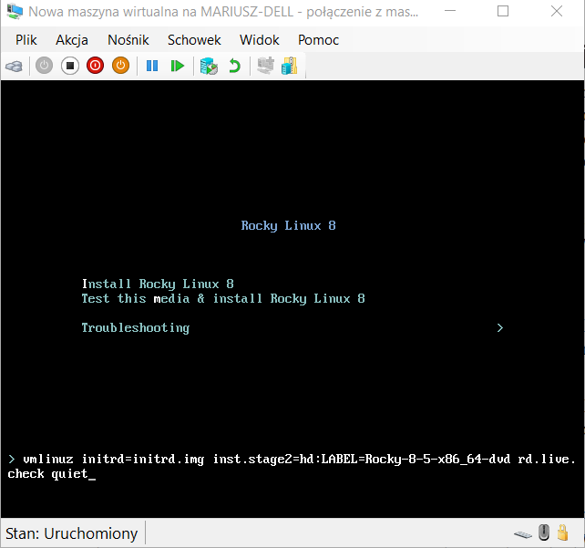
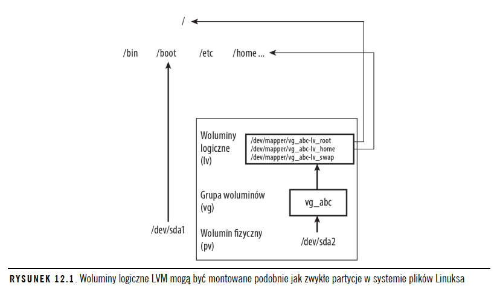

# Linux/Bash

# Obecna strona 253 
- do uzuępnienia czym jest cgroup. tylko mniej więcej, bez szczegółów,

# Odpowiedzi strona 797 


# Spis treści
[Koniec Biblii](#Koniec-biblii)

1. [System](#system-linux)
2. [Biblia](#Biblia)
    - [Uprawnienia](#Uprawnienia)
        - [Umask](#umask---definiowanie-uprawnień-domyślnych)
        - [Chown](#chown---Zmiana-właściciela-pliku)
    - [Praca z plikami tekstowymi](#Praca-z-plikami-tekstowymi)
        - [Vim](#vim)
        - [Wyszukiwanie plików](#wyszukiwanie-plików)
            - [Locate](#locate-1)
            - [Find](#find)
            - [Grep](#grep)
    - [Praca z procesami](#Zarządzanie-uruchomionymi-procesami)
        - [Background and foreground processes](#Background-and-foreground-processes )
    - [Administracja systemem linux](#administracja-systemem-linux)
    - [Zarządzanie kontami użytkowników](#Zarządzanie-kontami-użytkowników)
        - [useradd](#useradd---Ustalanie-ustawień-domyślnych-użytkownika)
        - [usermod](#usermod---Modyfikowanie-ustawień-użytkownika)
        - [userdel](#userdel---Usuwanie-użytkownika)
- [Koniec Biblii](#Koniec-Biblii)
2. [Skryptowanie](#skryptowanie)
	- [Zmienne specjalne](#zmienne-specjalne)
	- [Exitcode](#exitcode)
	- [Automatyczne tworzenie użytkownika - przykładowy skrypt](#automatyczne-tworzenie-u%C5%BCytkownika)
3. [Funkcje](#funkcje)
4. [Sieci](#sieci)
5. [Wirtualizacja](#wirtualizacja)


## System Linux 


# Biblia

## Używanie Powłoki 


# #TODO - Dodać zwijanie przy opisach poleceń i skrócić część notatek 

### <code>id</code>


id pokazuje id uzytkownika i gid ( id grupy uzytkownika)

Więcej informacji o tożsamości użytkownika dostarcza polecenie id:
<code>$ id</code>
> uid=1000(chris) gid=1000(chris) groups=1005(sales), 7(lp)

nazwa użytkownika to chris, (uid) 1000. Podstawową grupą użytkownika **chris**, podstawową grupą również jest **chris** (gid) 1000. 
Użytkownik chris należy również do innych grup o nazwach **sales** (gid 1005) i **lp** (gid 7).

**W dystrybucjach systemu Linux, w których jest włączony mechanizm SELinux (Security Enhanced Linux),
takich jak Fedora i Red Hat Enterprise Linux, na końcu danych wyjściowych polecenia id znajdują się
jeszcze informacje dodatkowe. Te dane mogą mieć następującą postać:** 
    
> context=unconfined_u:unconfined_r:unconfined_t:s0-s0:c0.c1023


### <code>type</code>

Określenie źródła poszczególnych poleceń powłoki jest możliwe po wydaniu polecenia type.
(Jeżeli używana powłoka jest inna niż bash, wtedy należy skorzystać z polecenia which).
Na przykład określenie miejsca położenia polecenia bash jest możliwe po wpisaniu:

<code>$ type bash</code>
> bash is /bin/bash

Jeżeli sprawdzane polecenie znajduje się
w kilku miejscach, wówczas dodanie opcji -a spowoduje wyświetlenie wszystkich znanych
lokalizacji danego polecenia. Na przykład polecenie type -a ls powinno wyświetlić położenie
systemowego polecenia ls i polecenia zdefiniowanego za pomocą aliasu.

<code>$ type -a ls</code>

> ls is aliased to `ls --color -F'
> ls is /usr/bin/ls


### Katalogi z komendami 
   
Większość poleceń dostarczanych z Linuksem znajduje się w katalogach /bin, /usr/bin oraz /usr/local/bin.
Katalogi /sbin i /usr/sbin zawierają polecenia administracyjne 


## Uprawnienia 

### Plik 

- Read - Wyświetlenie zawartości pliku
- Write - Zmiana zawartości pliku, zmianajego nazwy lub usunięcie pliku
- Execute - Uruchomienie pliku jako programu

### Katalog 

- Read - Wyświetlenie plików oraz podkatalogów danego katalogu
- Write - Dodawanie plików lub podkatalogów do danego katalogu, usunięcie plików lub katalogów z danego katalogu
- Execute - Wejście do katalogu, przeszukiwanie lub uruchomienie programu znajdującego się w nim, dostęp do metadanych pliku (wielkość, znaczniki czasu) dla wszystkich plików znajdujących się w tym katalogu

### Uprawnienia liczbowe  

- 4 - read
- 2 - write 
- 1 - execute 

```chmod -R 755 $HOME/myapps``` - zmiana uprawnien rekurencyjnie dla calego katalogu 

### Uprawnienia tekstowe 

- a - all
- u - user
- g - group
- o - others
  
- w - write
- r - read
- x - execute


- Nadawanie uprawnien tekstowo, poczatkowo do pliku wszyscy maja pelne uprawnienia  
    \- ( minus ) zabiera uprawnienia  
    \+ ( plus ) dodaje uprawnienia   
    
    Wszyscy maja pelne uprawnienia, po wykonaniu r-xr-xr-x  
    ```$ chmod a-w plik```  
    
    Nikt nie ma uprawnien, po wykonaniu rw-------  
    ```$ chmod u+rw plik```  

    Wynikiem wykonania tego polecenia chmod będą uprawnienia r-xr-x---:
    ```$ chmod ug+rx plik```

## Ważne !

**Użycie liter podczas rekurencyjnej zmiany uprawnień za pomocą polecenia chmod sprawdza się
lepiej niż zastosowanie liczb do tego celu** , ponieważ bity można zmieniać wybiórczo zamiast
wszystkich uprawnień jednocześnie. Załóżmy na przykład, że chcemy usunąć uprawnienia
„pozostałych użytkowników” bez zmiany innych uprawnień zdefiniowanych dla plików
i katalogów. W takim przypadku można wydać następujące polecenie:

```$ chmod -R o-w $HOME/myapps```

To polecenie powoduje rekurencyjne usunięcie uprawnień „pozostałych użytkowników” dla
wszystkich plików i katalogów znajdujących się w katalogu myapps. Jeżeli do zdefiniowania
uprawnień użylibyśmy liczby, np. 644, uprawnienie wykonywania zostałoby usunięte dla
wszystkich katalogów. Liczba 755 oznaczałaby włączenie uprawnienia wykonywania także
dla zwykłych plików. Opcja o-w umożliwia wyłączenie tylko jednego bitu i pozostawienie
pozostałych bitów bez zmian.

   
### Umask - Definiowanie uprawnień domyślnych 

```umask``` - Wyświetla obecnie ustawiony umask 

**Zmiana umask poleceniem umask zmienia to tylko tymczasowo !**

- Tymczasowa zmiana 
    ```umask 777``` 

- Stałą zmiana 
    Jeżeli wartość umask chcesz zmienić trwale, polecenie umask musisz dodać do pliku .bashrc
    znajdującego się w katalogu domowym (polecenie to umieść gdzieś na końcu pliku).
    Po następnym uruchomieniu powłoki wartość umask będzie odpowiadała zdefiniowanej
    w pliku **.bashrc** ( ```/etc/bashrc``` chcąc zmienić dla wszystkich użytkowników )


**The pre-defined initial permissions for files and directories are 666 and 777 respectively.**
Without any change in default umask permissions, all files created by user root will get 644 (666 - 022) permissions and all directories will get 755 (777-022) permissions.


### chown - Zmiana właściciela pliku 

Zmiana właściciela użytkownika i grupy na janek
```chown janek:janek /home/janek/notatka.txt```

Zmiana rekurencyjna właściciela i grupy dla katalogu  
```chown -R janek:janek /media/myusb```

### cp - kopiowanie plikow 

```cp -a test test2``` - kopia zachowała znaczniki daty i godziny oraz uprawnienia. Bez tej opcji użyte zostaną znaczniki daty i godziny oraz uprawnienia określone przez wartość umask

### mv - przenoszenie plików 

Dla mv jest użycie opcji -b. W takim przypadku, jeśli w położeniu
docelowym istnieje już plik o danej nazwie, to przed przeniesieniem nowego pliku nastąpi
utworzenie kopii zapasowej już istniejącego

### Przydatne !
wydanie polecenia mv, cp lub rm z ukośnikiem
na początku, np. \rm ogromny_katalog. Ukośnik powoduje użycie polecenia rm, a nie jego aliasu


## Praca z plikami tekstowymi 

### Wpisywanie tekstu do pliku przy pomocy ```cat```
cat << tekst > /tmp/yourfilehere
These contents will be written to the file.
        This line is indented.
tekst

### Vim 

```ZZ``` - wyjście z zapisem 
```:qw``` - wyjście z zapisem

```ZQ``` - wyjście bez zapisywania 
```:q!``` - wyjście bez zapisywania 

```u``` - undo 
```Ctrl+R``` - redo 


```:!polecenie``` - wydanie polecenia do shella z poziomu vima
```:!bash``` - otwiera nowego shella, **exit** wychodzi z shella i wraca do terminala 


## Wyszukiwanie plików 

### Locate 

Wyszukuje na podstawie nazw w swojej bazie danych, jest przez to wydajniejszy,
znajduje wszystkie pliki które zawierają podaną nazwę w swojej ścieżce,
jeżeli nie masz uprawnień do danego pliku/folderu to nie zostanie on odnaleziony,  
baza domyślnie jest odświeżana raz dziennie, odświeżanie manualne ```updatedb```

- ```updatedb``` - odświeżenie bazy danych locate 

- ```/etc/updatedb.conf``` - plik konfiguracyjny określający jakie pliki mają być ignorowane i nie dodawane do bazy, 
domyślnie **locate** nie przeszukuje 
    - plików z zewnętrznie zamontowanych dysków ( cifs, nfs ), 
    - /tmp
 
- ```locate -i``` - wyszukuje pliki niezależnie od wielkości liter

### Find 

Przeprowadza wyszukiwanie w całym systemie plików, jest wolniejszy niż locate,
Po znalezieniu plików można na nich przeprowadzać pewne
operacje (służy do tego opcja -exec lub -okay) przez wydanie żądanych poleceń.

1. Wyświetlenie szczegółów na temat plików
- ```find . -ls``` - przeszukuje obecny katalog, wyświetla szczegółowe informacje w formacie takim jak **ls -l** 

2. Wyszukiwanie po nazwie 
- ```find . -name``` -  
- ```find . -iname``` - 

3. Wyszukiwanie pliku o danych wielkościach 
- ```$ find /usr/share/ -size +10M``` - wyszukuje pliki większe niż 10MB
- ```$ find /mostlybig -size -1M``` - wyszukuje pliki mniejsze niż 1MB
- ```$ find /bigdata -size +500M -size -5G -exec du -sh {} \;``` - - wyszukuje pliki większe niż 500MB i mniejsze niż 5GB, wykonuje na nich polecenie du 

4. Wyszukiwanie plików na podstawie użytkowników i grup 
- ```$ find /home -user chris -ls``` - wyszukuje pliki należące do użytkownika chris 
- ```find /home \( -user chris -or -user janek \) -ls``` - wyszukuje pliki należące do użytkownika chris lub janek  
- ```find /etc -group ntp -ls``` - wyszukuje pliki należące do grupy ntp 
- ```find /var/spool -not -user root -ls``` - wyszukuje pliki nie należące do użytkownika root 

Do wyszukiwania za pomocą uprawnień służy ```-perm``` 

### #TODO - Dopisać co dokładnie oznacza które, nie do końca to rozumiem, strona w Biblii około 149
**Brak znaku** 
**Minus (-)** 
**Slash (/)** 


- ```$ find /usr/bin -perm 755 -ls``` - dokładne dopasowanie 
> 788884 28 -rwxr-xr-x 1 root root 28176 Mar 10 2014 /bin/echo

- ```$ find /myreadonly -perm /222 -type f```
> 685035 0 -rw-rw-r-- 1 chris chris 0 Dec 30 16:34 /myreadonly/abc

- ```$ find . -perm -002 -type f -ls``` - ustawienie typu jako file 
> 266230 0 -rw-rw-rw- 1 chris chris 0 Dec 30 16:28 ./LINUX_BIBLE/abc 


5. Wyszukiwanie plików na podstawie daty i godziny 

- ```$ find /etc/ -mmin -10``` - Wyszukuje pliki zmodyfikowane w ciągu ostatnich 10 min 
- ```$ find /bin /usr/bin /sbin /usr/sbin -ctime -3``` - File's  status was last changed n*24 hours ago.

### #TODO - Dodać wyszukiwanie na podstawie czasu, strona w Bibilii 150 

Jak widać na podstawie zaprezentowanych przykładów, masz możliwość wyszukiwania zmian
w treści lub w metadanych, które zaszły w ciągu określonej liczby dni lub minut. Opcje
dotyczące czasu (-atime, -ctime i -mtime) pozwalają wyszukiwać dane na podstawie podanej
liczby dni, które upłynęły od chwili ostatniego dostępu do pliku, jego zmiany bądź modyfikacji
jego metadanych. Opcje min (tzn. -amin, -cmin i -mmin) działają tak samo, ale dotyczą minut.
Wartości podawane jako argumenty dla opcji min i time są poprzedzone znakiem minus
(wskazującym, ile czasu należy odjąć od bieżącego dnia i godziny) lub znakiem plus
(wskazującym, ile czasu należy dodać do bieżącego dnia i godziny). Bez znaku minus lub plus
konieczne jest dokładne dopasowanie wartości

-atime n - File was last accessed n*24 hours ago.
-ctime n - File's  status was last changed n*24 hours ago.
-mtime n - File's data was last modified n*24 hours ago.


6. Wyszukiwanie plików za pomocą not i or

pliki należące do użytkownika janek, które nie zostały przypisane grupie janek:
- ```$ find /var/allusers/ -user janek -not -group janek -ls```
    > 679972 0 -rw-r--r-- 1 janek sales 0 Dec 31 13:02 /var/allusers/one

plik musi należeć do użytkownika janek, a ponadto jego wielkość nie może przekraczać 1 MB:
- ```$ find /var/allusers/ -user janek -and -size +1M -ls```
    > 679977 1812 -rw-r--r-- 1 janek root 1854379 Dec 31 13:09 /var/allusers/dict.dat


7. Wyszukiwanie plików i wykonywanie na nich poleceń


- ```$ find [opcje] -exec polecenie {} \;``` - **-exec** wykonuje polecenie dla wszystkich znalezionych plików  
- ```$ find [opcje] -ok polecenie {} \;``` - **-ok** pyta przed wykonaniem każdego z poleceń 

Każde polecenie musi zostać zakończone backslashem i średnikiem (\;)


**Przykłady użycia :**  
- ```$ find /etc -iname passwd -exec echo "Znaleziono plik {}" \;```
    > Znaleziono plik /etc/pam.d/passwd
    > Znaleziono plik /etc/passwd

- ```$ find /usr/share -size +5M -exec du {} \; | sort -nr```
    > 116932 /usr/share/icons/HighContrast/icon-theme.cache
    > 69048 /usr/share/icons/gnome/icon-theme.cache
    > 20564 /usr/share/fonts/cjkuni-uming/uming.ttc


- ```# find /var/allusers/ -user janek -ok mv {} /tmp/janek/ \;```
    > < mv ... /var/allusers/dict.dat > ? y
    > < mv ... /var/allusers/five > ? y

### Grep 

```grep [opcja] [pattern] [plik]``` - wyszukuje patternu w podanych plikach  

```-i``` - małe/duże litery   
```-R``` - wyszukiwanie rekurencyjne ( wewnątrz wszystkich folderów )  
```-v``` - wyszukuje wiersze które **nie zawierają** podanej frazy    
```-l``` - wyśiwetla **nazwy plików** zawierających podaną frazę, bez wyświetlania zawartości   


## Zarządzanie uruchomionymi procesami

### ps

```ps aux``` - wyświetla wszystkie uruchomione procesy dla wszystkich użytkowników w systemie 
```-e``` - wyświetla wsyzystkie działające procesy 
```-f``` - full-format, including command lines


```-o``` - pozwala na wybranie konkretnych kolumn 
    - kolumny które mogą zostać wyświetlone = pid,user,uid,group,gid (group id),vsz (zaalokowana pamięć wirtualna),rss (faktycznie użyta
pamięć operacyjna),comm (pełne polecenie, które zostało wydane)

```sort=[nazwa_kolumny]``` - sortowanie na podstawie podanej kolumny 
```sort=-[nazwa_kolumny]``` - sortowanie odwrotne po nazwie kolumny 


### top 

```h``` - w oknie top w każdym momencie można użyć ```h``` - wyświetla to pomoc   
  
```M``` - sortowanie według ilości zajmowanej pamięci  
```P``` - sortowanie według zużycia procesora ( domyślna opcja )
```R``` - sortowanie w odwrotnej kolejności 
  
```1``` - wyświelta zużycie wszystkich procesorów ( jeżeli jest ich więcej )    
```u``` - wyszkuje procesy otwarte przez podanego użytkownika   
  
   
```r``` - renice procesu  
```k``` - kill procesu 
    **-9** - natychmiastowe zakończenie 
    **-15** - eleganckie zakończenie 
  
  
## Procesy w tle i na pierwszym planie 

- ```$ find /usr > /tmp/allusrfiles &``` - uruchamia proces w tle
    >  [3] 15971
    > - [3] - numer zadania
    > - 15871 - numer procesu


- ```jobs``` - wyświetla wszytkie obecnie działające zadania 
    - ```-l``` - wyświetla pid i status dla jobów 
    - ```-p``` - wyświetla tylko pidy dla jobów  

- ```$ fg %1``` - przenosi pierwsze zadanie z listy jobs **na pierwszy plan** 
- ```$ bg %5``` - przenosi piąte zadanie z listy jobs **w tło**

## Zamykanie procesu i zmiana jego priorytetu

### Kończenie działania procesów 

Do najczęściej używanych
sygnałów z poziomu powłoki zaliczamy 

- SIGKILL (9) - natychmiastowe zakończenie procesu 
- SIGTERM (15) - eleganckie zakończenie procesu 
- SIGHUP (1) - ponowne załadowanie plików konfiguracyjnych 

**kill i kilall** mozna wykorzystywac do kończenia lub zmiany procesu, **np. nakazujący procesowi ponowne odczytanie plików konfiguracyjnych, wstrzymanie działania, kontynuowanie działania po wcześniejszym wstrzymaniu itd.**


```$ killall -9 testme``` - kilall wysyła sygnał na podstawie nazwy proces


### Tabela z syganłami dla procesów 
### #TODO - tabela do poprawienia 
<table>
    <tr>
        <th>Sygnał</th>
        <th>Liczba</th>
        <th>Opis</th>
    </tr>
    <tr>
        <td>SIGHUP</td>
        <td>SIGINT</td>
        <td>SIGQUIT</td>
        <td>SIGABRT</td>
        <td>SIGKILL</td>
        <td>SIGTERM</td>
        <td>SIGCONT</td>
        <td>SIGSTOP</td>
    </tr>
    <tr>
        <td>1</td>
        <td>2</td>
        <td>3</td>
        <td>6</td>
        <td>9</td>
        <td>15</td>
        <td>19, 18, 25</td>
        <td>17, 19, 23</td>
    </tr>
    <tr>
        <td>Wykryto zerwanie połączenia z terminalem kontrolnym lub zamknięcie jego procesu</td>
        <td>Przerwanie z poziomu klawiatury</td>
        <td>Zakończenie działania zainicjowane z poziomu klawiatury</td>
        <td>Sygnał przerwania z abort(3)</td>
        <td>Natychmiastowe zakończenie działania</td>
        <td>Sygnał zakończenia działania procesu</td>
        <td>Kontynuowanie działania wcześniej wstrzymanego procesu</td>
        <td>Zatrzymanie procesu</td>
    </tr>
</table>
 
Zwróć uwagę na istnienie wielu liczb reprezentujących sygnały SIGCONT i SIGSTOP, ponieważ
poszczególne architektury sprzętowe używają różnych liczb wskazujących na te sygnały.
Na przykład architektury x86 i Power w większości przypadków wykorzystują wartość
środkową. Pierwsza wartość zwykle sprawdza się na platformach Alpha i SPARC, podczas
gdy ostatnia — w architekturze MIPS.


### Definiowanie priorytetu procesu za pomocą poleceń nice i renice

- Procesy mają wartości **-20 do 19, im niższa wartość tym proces ma wyższy priorytet**, domyślnie jest 0,
- Zwykły użytkownik może przypisać większą wartość priorytetu, ale nie niższą. Dlatego jeśli użytkownik przypisze procesowi wartość 10 dla priorytetu, a później będzie
chciał przywrócić poprzednią wartość priorytetu, np. 5, taka operacja zakończy się
niepowodzeniem. Podobnie próba przypisania wartości ujemnej priorytetowi procesu
również zakończy się niepowodzeniem.
- Zwykły użytkownik może zmieniać priorytet jedynie własnym procesom.


```# nice -n +5 updatedb &``` - **uruchamia polecenie updatedb z nice +5** i uruchomienie go w tle

Potiwerdzenie zmiany nice procesu na 5 za pomocą polecenia **top**   
> PID USER PR NI VIRT RES SHR S %CPU %MEM TIME+ COMMAND   
> 20284 root 25 5 98.7m 932 644 D 2.7 0.0 0:00.96 updatedb   

```# renice -n -5 20284``` - **zmienia wartośc nice** polecenia updatedb na -5


### Ograniczanie procesów za pomocą cgroup

### #TODO - strona 167 - usupełnić informacje na temat cgroup, dopisać mniej więcej to czym jest, nie opisywać samych grup 

### #TODO - szrobić ćwiczenia od nowa


## Skrypty powłoki 

### Debugowanie
Na początku skryptu można umieścić polecenie set -x w celu wyświetlenia każdego polecenia wykonywanego przez skrypt.

```$ set -x mojskrypt``` lub ```$ bash -x mojskrypt``` - wyświetla każdą wykonywana komendę ( **równwnież to co jest przypisane pod alias **)

```nazwa_zmiennej=$(echo "test")``` - przypisanie komendy pod zmienną 
```BILANS="$BiezacyBilans"``` - przypisanie zmiennej BILANS wartości zmiennej BiezacyBilans 

```unset zmienna``` - zwolnienie zmiennej ```zmienna```


## Zmienne specjalne

- **$?** - wynik ostatniej komendy 
_( najczesciej  0/2 - 0 to komenda wykonana prawidlowo, wszystko inne to blad, nie musi byc to 2, liczba moze byc nawet ujemna )_
- **$$** - numer procesu używanego przez komende
- **!$** - ostatni użyty argument 
- **$0** - nazwa programu 
- **$1** - argumenty, zaczynaja sie od jednego, nie musi byc to jeden 
- **$#** - Liczba podanych parametrów 
- **$*** - Wszystkie parametry jako string 
- **$@** - Podane parametry w postaci tablicy 

```man bash``` - Pełna lista zmiennych specjalnych


###  Odczytanie danych podanych przez użytkownika

```read -s``` = secret, ukrywa znaki wpisywane przez użytkownika 
```read -p``` <Tekst dla uzytkownika\> = prompt, tekst dla uzytkownika 

```read -p "Ile masz lat i wzrostu" wiek wzrost``` - Komenda wyświetla wiadomośc i zapisuje podane wartość do zmiennej **wiek** i **wzrost**   
 
```bash
read -s -p "Enter a password for the new user "$1": " USER_PASSWORD
```

```$MIASTO``` jest skróconym zapisem ```${MIASTO}```


### Przykłady przypisania zmiennych w powłoce bash 
Konstrukcja Znaczenie
${zmienna:-wartość} Jeżeli zmienna nie jest ustawiona bądź jest pusta, wówczas zostanie używa wartość.
${zmienna#wzorzec} Usunięcie krótszego dopasowania wzorca z początku wartości zmiennej.
${zmienna##wzorzec} Usunięcie dłuższego dopasowania wzorca z początku wartości zmiennej.
${zmienna%wzorzec} Usunięcie krótszego dopasowania wzorca z końca wartości zmiennej.
${zmienna%%wzorzec} Usunięcie dłuższego dopasowania wzorca z końca wartości zmiennej.


**Przykłady użycia przypisać z tabeli powyżej** 

> $ THIS="Przykład"
> $ THIS=${THIS:-"Nieustawiona"}
> $ THAT=${THAT:-"Nieustawiona"}
> $ echo $THIS
> Przykład
> $ echo $THAT
> Nieustawiona


W poniższym przykładzie zmienna MOJANAZWAPLIKU otrzymuje wartość /home/janek/
mojplik.txt. Następnie zmiennej PLIK zostaje przypisana wartość mojplik.txt, natomiast
zmiennej KATALOG wartość /home/janek. W zmiennej NAZWA nazwa pliku zostaje skrócona
do mojplik, a zmienna ROZSZERZENIE przechowuje wartość txt. (W celu wypróbowania
przedstawionych tutaj przykładów należy je po prostu wpisać w powłoce, podobnie jak
w przypadku poprzedniego przykładu. Następnie wartości zmiennych można wyświetlić
za pomocą polecenia echo). Wpisz kod przedstawiony po lewej stronie; informacje
zamieszczone po prawej stronie wyjaśniają sposób działania poszczególnych poleceń.
MOJANAZWAPLIKU="/home/janek/mojplik.txt" # Zdefiniowanie wartości zmiennej

> MOJANAZWAPLIKU  
> PLIK=${MOJANAZWAPLIKU##*/} # PLIK otrzymuje wartość "mojplik.txt"  
> KATALOG=${MOJANAZWAPLIKU%/*} # KATALOG otrzymuje wartość "/home/janek"  
> NAZWA=${PLIK%.*} # NAZWA otrzymuje wartość "mojplik"  
> ROZSZERZENIE=${PLIK##*.} # ROZSZERZENIE otrzymuje wartość "txt"  


1. Inkrementacja

```$ I=0```
```$ echo Wartość po inkrementacji wynosi $((++I))```
> Wartość  po inkrementacji wynosi 1


2. Polecenia if…then

```bash
ZMIENNA=1
if [ $ZMIENNA -eq 1 ] ; then
echo "Zmienna ma wartość 1"
fi
```

### Wszystkie instrukcje warunkowe 
```man test``` - wszystkie instrukcje warunkowe 

- ```=``` - Stringi są równe 
- ```!=``` - Stringi są różne 

- ```-eq``` - Liczby są równe


elif - else if  
```bash 
if [ -f "$nazwapliku" ] ; then
echo "$nazwapliku to zwykły plik"
elif [ -d "$nazwapliku" ] ; then
echo "$nazwapliku to katalog"
else
echo "Nie mam pojęcia, czym jest $nazwapliku"
fi
```

Domlyślnie if zwraca 0 lub 1, podobnie jak wykonywany program, **0 oznacza prawdę**

### Exitcode
**Dodawanie innych exit kodow pomaga uzytkownikom**
* Exitcode wieksze niz 0 mozemy definiowac sami 
* Exitcode 0 - kod wykonany prawidlowo 
* Exitcode 1 i kazdy wiekszy - kod wykonany z bledem 

np. ```exit 141```


- ```&&``` - jeżeli polecenie **wykonało się** poprawnie to wykonuje następne
- ```||``` - jeżeli polecenie **nie wykonało się** poprawnie to wykonuje następne 

```bash
nazwakatalogu=mojkatalog
[ -e $nazwakatalogu ] && echo $nazwakatalogu już istnieje || mkdir $nazwakatalogu
```


3. Case
### #TODO - case - opisać jakoś sensownie strona 180


4. Pętla for…do

Konstrukcja pętli for

```bash
for ZMIENNA in LISTA
do
{ polecenia }
done
```

5. Pętle while…do i until…do

### #TODO - strona 182 - może coś opisać 


6. Przydatne programy 

### #TODO - sed - dodać opis, strona 183

# #TODO - Strona 186 - ćwiczenia do rozdziału, do zrobienia 


# Administracja systemem Linux

## Podstawowa administracja systemem Linux

### sudo/root 

- ```visudo ``` - służy do ecycji plików jako root, zapis działa nawet gdy nikt nie ma do niego prawa 

- ```/etc/sudoers``` - Plik w którym nadawane są uprawnienia sudo 

    ```janek ALL=(ALL) ALL``` - Nadanie użutkownikowi pełnych uprawnień sudo w pliku **sudoers**

Domyślnie sudo działa bez wpisywania hasła przez 5 minut, zmiany można dokonać w **/etc/sudoers** edytując wartość zmiennej **passwd_timeout**


### Pliki konfiguracyjne

- ```$HOME``` - osobiste pliki konfiguracyjne

- ```/etc``` - pliki konfiguracyjne które wpływają na cały system
    - ```/etc/httpd``` — katalog zawiera różne pliki służące do konfiguracji zachowania serwera
    WWW Apache
    - ```/etc/mail``` — pliki konfigurujące usługę poczty elektronicznej (sendmail).
    - ```/etc/postfix``` — pliki konfiguracyjne agenta transportu poczty elektronicznej (postfix)
    - ```/etc/cups``` — katalog zawiera pliki używane do konfiguracji usługi drukowania CUPS.


### #TODO - Strona 203 - katalogi do uzupełnienia, przerobić na tabelę 
Wybrane spośród najbardziej interesujących plików konfiguracyjnych w katalogu /etc

Plik Opis  
bashrc Ustawienia konfiguracyjne powłoki bash, których zasięg obejmuje cały system. (W niektórych dystrybucjach Linuksa
plik nosi nazwę bash.bashrc).
crontab Ustawienie godzin uruchamiania zautomatyzowanych zadań oraz zmiennych powiązanych ze środowiskiem cron
(na przykład SHELL i PATH).
exports Plik zawiera listę katalogów lokalnych dostępnych do współdzielenia ze zdalnymi komputerami za pomocą
Network File System (NFS).
fstab Identyfikacja najczęściej stosowanych urządzeń magazynujących dane (dysk twardy, napędy DVD i CD-ROM itd.) oraz
miejsc zamontowania ich w systemie Linux. Plik jest używany przez polecenie mount do wyboru systemów plików
montowanych podczas uruchamiania komputera.
group Identyfikacja nazw oraz identyfikatorów grup (GID), które zostały zdefiniowane w systemie. Uprawnienia grup w Linuksie
są definiowane przez drugi bądź trzeci zbiór bitów rwx (read, write, execute) powiązanych z każdym plikiem i katalogiem.
gshadow Zawiera zaszyfrowane hasła grup


### journalctl, przeglądania dziennika zdarzeń systemd

Proces uruchamiania komputera, jądro oraz wszystkie usługi zarządzane przez systemd kierują swoje komunikaty stanu i błędów bezpośrednio do dziennika systemd.

Przykłady użycia polecenia ```journalctl``` :

```bash
journalctl
journalctl --list-boots | head
```
> -2 93bdb6164... Sat 2020-01-04 21:07:28 EST—Sat 2020-01-04 21:19:37 EST
> -1 7336cb823... Sun 2020-01-05 10:38:27 EST—Mon 2020-01-06 09:29:09 EST
> 0 eaebac25f... Sat 2020-01-18 14:11:41 EST—Sat 2020-01-18 16:03:37 EST

```bash
journalctl -b 488e152a3e2b4f6bb86be366c55264e7
journalctl -k
```

- Wszystkie komunikaty  
    - ```journalctl``` - wywoływane bez opcji pozwala przejrzeć wszystkie komunikaty zapisane w dzienniku systemd
    - ```journalctl -a``` - Wyświetla wszystkie kolumny
    - ```journalctl -f``` - wyświetlanie journalctl na bierząco

- Bootowanie  
    - ```journalctl --list-boots``` - wyświetla identyfikatory rozruchu dla każdej operacji uruchomienia systemu i czas w któym nastąpiły
    - ```journalctl -b [ID bootowania]``` - wyświetla informacje dotyczące określonej operacji uruchomienia systemu

- Komunikaty jądra   
    - ```journalctl -k``` - Wyświetlenie jedynie komunikatów jądra 

- Konkretna usługa   
    - ```journalctl _SYSTEMD_UNIT=sshd.service``` - Opcje _SYSTEMD_UNIT= umożliwiają wyświetlenie komunikatów dla konkretnych usług (tutaj jest to sshd) albo dla innego pliku systemd (np. inna usługa lub punkt montowania).

- Priorytet komunikatów   
    - ```journalctl PRIORITY=0``` - Komunikaty powiązane z określonym poziomem rejestrowania danych, dla opcji **PRIORITY=** przypisujemy wartość z przedziału od 0 do 7, 0 to komunikaty krytyczne 


### rsyslogd 

**rsyslogd** - odpowiadaa za zbieranie komunikatów oraz kierowanie ich do plików dzienników zdarzeń lub zdalnych hostów rejestrowania danych. 
Zapisuje informacje w pliku **/etc/rsyslog.conf**. 
Komunikaty są zazwyczaj kierowane do plików dzienników zdarzeń, które zwykle znajdują się w katalogu /var/log, choć w celu zapewnienia bezpieczeństwa nie zawsze tak jest, 

Przykłady najczęściej spotykanych plików : 

- ```boot.log``` — zawiera komunikaty generowane w trakcie uruchamiania usług podczas startu systemu.
- ```messages``` — zawiera wiele ogólnych informacji o systemie.
- ```secure``` — zawiera komunikaty związane z kwestiami bezpieczeństwa, na przykład dotyczące logowania i innych zadań związanych z uwierzytelnianiem użytkowników.


### Sprawdzanie komponentów komputera

### #TODO - # Strona 208 - dmesg do opisania 
- ```dmesg``` - wyświetla obecną wersję jądra, print or control the kernel ring buffer

- ```lspci``` - wyświetla listę szyn PCI w komputerze i podłączone do nich urządzenia.
    - ```lspci -v``` lub ```lspci -vvv``` - dodanie jednego **v** lub więcej **v** wyświetla więcej informacji szczegółowych

- ```lsusb``` - wyświetla informacje dotyczące wejść USB oraz podłączonych do nich urządzeń
    - ```lsusb -v``` lub ```lsusb -vvv``` - podobnie jak przy lspci dodanie jednego lub więcej parametru **v** wyświetla dodatkowe informacje 

- ```lscpu``` - wyświetla informacje na temat procesora 


### Praca z wczytywanymi modułami

Moduły jądra są instalowane w podkatalogach katalogu /lib/modules. Nazwa katalogu bazuje
na wersji jądra. Na przykład jeśli jądro jest w wersji 5.3.8-200.fc30.x86_64, to moduły dla niego
będą się znajdowały w katalogu /lib/modules/5.3.8-200.fc30.x86_64.


- ```lsmod``` - wyświetla listę aktualnie wczytanych modułów jądra

- ```modinfo``` - wyświetla informacje o dowolnym z wczytanych modułów 
    - ```modinfo -d e1000``` - opis modułu e1000 (moduł do obsługi karty sieciowej)
        > Intel(R) PRO/1000 Network Driver
    - ```modinfo -a e1000``` - autor 
        > Intel Corporation, <linux.nics@intel.com>
    - ```modinfo -n e1000``` - katalog zawierający  
        > /lib/modules/4.18.0-348.7.1.el8_5.x86_64/kernel/drivers/net/ethernet/intel/e1000/e1000.ko.xz

### Wczytywanie modułów

- ```modprobe``` - Dodawanie modułów do działającego jądra, **po restarcie systemu wczytane moduły nie będą już dostępne**, aby były należy dodać wiersz z poleceniem modprobe do skryptów startowych, dodawać można moduły,

    Przed załadowaniem moduły muszą zostać wcześniej skompilowane i zainstalowane w katalogu **/lib/modules**, 
    przykładem dla którego możemy chcieć załadować moduł jest dodanie nowego systemu plików  

    **modprobe** wczytuje moduły tymczasowo ( do czasu restartu ), aby załadować je na stałe dodajemy **modprobe** do skryptów startowych systemu

- ```rmmod``` - Usuwanie modułów

    - ```rmmod parport_pc``` - Przykładowe usunięcie modułu **parport_pc**

    Jeżeli moduł jest w użyciu, trzeba spróbować zamknąć proces używający danego
    urządzenia, a następnie ponownie wydać polecenie rmmod. 

    - ```modprobe -r [nazwa_modułu]``` - usunięcie modułu razem z modułami zależnymi od wskazanego do usunięcia  


### Strona 214 ćwiczenia do rozdziału


Wykonanie do sprawdzenia 

1. sudo systemctl sart  
3. sudo find /var/spool ! -user root -ls


9. sudo modprobe bttv
lsmod | grep bttv

Tak, razem z modułem bttv zostały dodane też kolejne 

10. sudo modprobe -r bttv
lsmod | grep bttv


## Instalacja systemu Linux

- **kdump** - włączenie tej opcji powoduje, że pewna ilość pamięci RAM zostanie zarezerwowana do przechwycenia zawartości jądra w przypadku jego awarii

- Pliki typu kickstart - Skrypty umieszczane w plikach typu kickstart mogą wykonywać wybrane polecenia przed skonfigurowaniem
lub po skonfigurowaniu systemu Linux przez program instalacyjny, np. dodawaanie użytkowników, zmiana uprawnień, pobieranie plików przez sieć
Podczas instalacji RHEL plik typu kickstart zawierający udzielone odpowiedzi na wszystkie pytania programu instalacyjnego będzie dostępny jako /root/anaconda-ks.cfg. Można go wykorzystać w trakcie następnego procesu instalacji. 

Więcej informacji w podręczniku str 279 

[Tutorial dot kickstar od RedHata](https://access.redhat.com/documentation/en-us/red_hat_enterprise_linux/8/html/performing_an_advanced_rhel_installation/performing_an_automated_installation_using_kickstart)


### #TODO - jak zbackupować całość systemu 




# Strona przed zmianami z pociągu, sprawdzić czy nie ma czegoś do opisania 

# Początek zmian pociągowych 

## #TODO - Sprawdzić czy to co wrzuciłem z braków to wszystko  

## Opcje rozruchowe dla plików typu kickstart i zdalnych repozytoriów
Strona 234


## Partycjonowanie dysku twardego 
strona 235


## Używanie programu uruchamiającego GRUB

### rpm

**rpm nie instaluje zależności potrzebnych do zainstalowania danego pakietu, do zainstalowania pakietu potrzebna jest dokładna ścieżkla pliku .rmp**


```-q``` - querry  
```-i``` - information  

```rmp -q firefox``` 
> firefox-67.0-4.fc30.x86_64


```rmp -qi firefox```
> Name : firefox  
Version : 67.0  
Release : 4.fc30  
Architecture: x86_64  
Install Date: Sun 02 Jun 2019 09:37:25 PM EDT  
Group : Unspecified  
Size : 266449296  
License : MPLv1.1 or GPLv2+ or LGPLv2+  
Signature : RSA/SHA256, Fri 24 May 2019 12:09:57 PM EDT, Key ID ef3c111fcfc659b9  
Source RPM : firefox-67.0-4.fc30.src.rpm  
Build Date : Thu 23 May 2019 10:03:55 AM EDT  
Build Host : buildhw-08.phx2.fedoraproject.org  
Relocations : (not relocatable)  
Packager : Fedora Project  
Vendor : Fedora Project  
URL : https://www.mozilla.org/firefox/  
Bug URL : https://bugz.fedoraproject.org/firefox  
Summary : Mozilla Firefox Web browser  
Description :  
Mozilla Firefox is an open-source web browser, designed for standards  
compliance, performance and portability.  


### yum

**yum instaluje pakiet razem z jego zależnościami na podstawie repozytoriów, w nowych wersjach RHEL yum jest linkem do dnf** 

Repozytoria yum mogą być umieszczane w katalogu, na serwerze WWW (http://), FTP (ftp://), CD lub DVD albo w katalogu lokalnym (file:///).   
Położenie tych repozytoriów jest następnie przechowywane w pliku użytkownika systemu ```/etc/yum.conf``` lub częściej , w oddzielnych plikach konfiguracyjnych w katalogu ```/etc/yum.repos.d``` ( obecnie pliki konfiguracyjne te są linkami do plików dnf )

```yum [opcje] polecenie``` - podstawowa składnia 
```yum install firefox``` - instalacja pakietu firefox

### yum.conf 

strona 252 - dopisać informacje na temat plików konfiguracyjnych 

### Instalacja pakietu przy pomocy yum 

1. Sprawdzanie pliku /etc/yum.conf

### #TODO - Dodać opis

2. Sprawdzanie plików /etc/yum.repos.d/*.repo

Repozytoria oprogramowania mogą być włączane przez umieszczanie w katalogu /etc/yum.repos.d plików z rozszerzeniem .repo wskazujących położenie jednego lub więcej repozytoriów.

Przykład dla pliku ```/etc/yum.repos.d/myrepo.repo```

> [myrepo]  # Nazwa repozytorium  
name=Moje repozytorium  # Prosty opis  
baseurl=http://myrepo.example.com/pub/myrepo    # Położenie repo, lokalne zaczynają się od ( file:/// )   
enabled=1   # Opcja wskazuje czy dane repozytorium jest aktywne  
gpgcheck=1  # Sprawdzenie klucza, spradza czy repozytorium nie zostało zmienione  
gpgkey=file:///etc/pki/rpm-gpg/MYOWNKEY # klucz  


3. Pobieranie z repozytorium YUM pakietów RPM i metadanych

Po wydaniu polecenia yum zostają sprawdzone wszystkie repozytoria, co oznacza pobranie do systemu lokalnego metadanych o wszystkich znajdujących się w nich pakietach.

Metadane są w systemie lokalnym przechowywane w katalogu ```/var/cache/yum```. Wszelkie kolejne zapytania dotyczące pakietów, grup pakietów lub innych informacji o repozytorium
są pobierane z buforowanych metadanych, aż do upływu czasu ich ważności.

**Domyślnie czas ważności to 48 godzin dla dnf**, można go zmienić za pomocą opcji **metadata_expire w pliku /etc/yum.conf**.

Następnie polecenie yum szuka pakietów wskazanych do instalacji i sprawdza, czy wymagane są pakiety zależne, po przygotowaniu listy pakietów prosi o potwierdzenie a następnie instaluje.


4. Instalowanie pakietów RPM w systemie plików Linuksa

Po pobraniu do katalogów tymczasowych wszystkich niezbędnych pakietów narzędzie
yum wykonuje polecenia rpm dla każdego instalowanego pakietu.

Jeżeli pakiet zawiera jakiekolwiek skrypty wykonywane przed lub po instalacji (np. odpowiedzialne za utworzenie specjalnego konta użytkownika lub katalogów), zostają one uruchomione.


5. Przechowywanie w lokalnej bazie danych RPM medadanych repozytorium YUM

Metadane znajdujące się w instalowanym pakiecie RPM zostają skopiowane do lokalnej **bazy danych RPM**. 

Gdy informacje dotyczące zainstalowanych pakietów znajdują się w lokalnej bazie RPM, można wykonywać do niej zapytania. 
Np. można sprawdzić zainstalowane pakiety, wyświetlić komponenty tych pakietów, a także zajrzeć do skryptów i dzienników zdarzeń powiązanych z poszczególnymi pakietami. 
Istnieje również możliwość zweryfikowania zainstalowanych pakietów względem **bazy danych RPM**.

Polecenie **rpm** to najlepsze narzędzie do wykonywania zapytań do **bazy danych RPM**.


### #TODO - strona 254 - sprawdzić czy jest zostawić tak długo opisane kroki czy ich nie skrócić 


### Wyszukiwanie pakietów za pomocą yum 

```yum search editor``` - wyszukuje słowa **editor** w nazwie lub opisie pakietów 
>...  
eclipse-veditor.noarch : Eclipse-based Verilog/VHDL plugin  
ed.x86_64 : The GNU line editor  
emacs.x86_64 : GNU Emacs text editor  

```yum info emacs``` - wyświetlenie informacji o pakiecie
> yum info emacs  
Name : emacs  
Epoch : 1  
Version : 26.2  
Release : 1.fc30  
...  

```yum provides dvdrecord``` - Znajduje pakiet po nazwie polecenia, pliku konfiguracyjnego lub biblioteki
> wodim-1.1.11-41.fc30.x86_64 : A command line CD/DVD recording program   
Repo : fedora  
Matched from:  
Filename : /usr/bin/dvdrecord  


- Podpolecenie ```list``` pozwala wyświetlić listę nazw pakietów na różne sposoby. 
    - ```yum list "nazwa_pakietu"``` - wyświetla wersję i repozytorium danego pakietu
    - ```yum list available``` - wyświetla dostępne pakiety
    - ```yum list installed``` - wyświetla zainstalowane pakiety 
    - ```yum list all``` - wyświetla wszystkie pakiety 

```yum deplist emacs``` - Wyświetla komponenty zależne (dependency) a także dostarczane w samym pakiecie (provider) 
> yum deplist emacs | less  
package: emacs-1:26.1-8.fc30.x86_64  
dependency: /bin/sh  
provider: bash-5.0.7-1.fc30.i686  


### Instalowanie i usuwanie pakietów 

```yum install emacs``` -  zainstalowanie jednego lub więcej pakietów razem z niezbędnymi zależnościami
```yum reinstall emacs``` - Od nowa instaluje wymagane zależności
```yum remove emacs``` - Usuwa pakiet emacs


Podpolecenie ```history``` pozwala przejżeć historię operacji ```yum``` i je wycofać za pomocą opcji ```history undo```


- ```yum history``` - wyświetla historię transakcji polecenia ```yum```
    > ID | Command line | Date and time | Action(s) | Altered  
    12 | install emacs | 2019-06-22 11:14 | Install | 7  
     3 | install tmux  | 2022-01-19 06:33 | Install | 1  
     2 | update -y     | 2022-01-19 06:28 | I, U    | 91  
    ...  

- ```yum history info 12``` - wyświetla informacje na temat transakcji o **ID 12**
    > Transaction ID : 12  
    ...  
    Command Line : install emacs  
    ...  

- ```yum history undo 12``` - wycofuje transakcję z **ID 12** ( w tym przypadku instalacji emacs )


### Uaktualnianie pakietów

```yum check-update``` - sprawdza czy dostępne są updaty 

```yum update``` - updatuje **wszystkie** pakiety dla których dostępne są aktualizacje 

```yum update cups``` - updatuje **jedynie pakiet cups**, jeżeli razem z nim muszą zostać uaktualnione także pewne pakiety zależne, one również będą pobrane i zainstalowane.


### Uaktualnianie grup pakietów

```yum grouplist``` - Wyświetlenie listy grup dostępnych pakietów 
> Available Environment Groups:  
Fedora Custom Operating System  
Minimal Install  
Fedora Server Edition  
...  
Installed Groups:  
LibreOffice  
GNOME Desktop Environment  
Fonts  
...  
Available Groups:  
Authoring and Publishing  
Books and Guides  
C Development Tools and Libraries  
...  

```yum groupinfo gnome``` - wyświetlenie opisu grupy LXDE, pakietów obowiązkowych, domyślnych i opcjonalnych   
> Group: GNOME    
 Description: GNOME is a highly intuitive and user-friendly desktop environment.   
 Mandatory Packages:  
   ModemManager   
   NetworkManager-adsl  
 ...  

```yum groupinstall gnome``` - instalacja pakietów grupy gnome

```yum groupremove LXDE``` - usunięcie grupy pakietów gnome 


### Konserwacja bufora i bazy danych pakietów RPM


Opróżnienie bufora to operacja, którą należy przeprowadzać od czasu do czasu. Jeżeli
zdecydujesz się na zachowanie pobranych pakietów po ich zainstalowaniu (domyślnie są
usuwane, na podstawie opcji keepcache=0 w pliku /etc/yum.conf), wówczas katalogi bufora
(/var/cache/yum) mogą się zapełnić. Metadane przechowywane w katalogach bufora mogą
zostać usunięte, co podczas następnego wykonania polecenia yum spowoduje pobranie od nowa
metadanych dla wszystkich włączonych repozytoriów. Oto przykład opróżnienia metadanych:

- Opróżnianie bufora yum

    ```yum clean packages```
    > 14 files removed  

    ```yum clean metadata```
    > Cache was expired  
    16 files removed  

    ```yum clean all```
    > 68 files removed  


- Sprawdzenie i naprawienie bazy danych yum

    ```yum check``` - Sprawdza bazę danych **yum** w przypadku jej ewentualnego uszkodzenia 
    > error: db5 error(11) from dbenv->open: Resource temporarily  
    unavailable  
    error: cannot open Packages index using db5-Resource temporarily  
    unavailable(11)  
    error: cannot open Packages database in /var/lib/rpm  
    Error: Error: rpmdb open failed  

    ```rpm --rebuilddb``` - odbudowuje uszkodzoną bazę danych yum 

    ```yum check``` - po raz kolejny sprawdza bazę danych **yum** w celu potwierdzenia jej naprawienia 


**rpm to polecenie, które najlepiej sprawdza się w pracy z lokalną bazą danych RPM**


```dnf download firefox``` - **samo pobranie** pakietu **rpm** dla firefox 
> firefox-60.7.0-1.el8_0.x86_64.rpm 6.1 MB/s | 93 MB 00:15  


### rmp, instalowanie, analizowanie i weryfikowanie oprogramowania


```rpm --install ./zsh-5.5.1-6.el8.x86_64.rpm``` - **instalacja** pakietu **zsh** znajdującego się w lokalnym folderze

```rpm --update ./zsh-5.5.1-6.el8.x86_64.rpm``` - **update** pakietu **zsh** do wersji z pliku znajdującego się w lokalnym folderze,  
```--update lub -U``` - instaluje pakiet **również jeżeli nie znajdował się wcześniej w systemie**  
```--freshen lub -F``` - instaluje pakiet **tylko jeżeli znajdował się wcześniej w systemie**  
> Verifying... ######################### [100%]  
Preparing... ######################### [100%]  
1:zsh-5.5.1-6.el8 ######################### [100%]  

```rpm --Uhv ./zsh-5.5.1-6.el8.x86_64.rpm``` - **update, hash, verbose** - aktualizacja z użyciem opcji które mówią więcej o procesie

```rpm -e emacs``` - usunięcie pakietu 


### Pobieranie informacji o pakiecie


```rpm -qi zsh``` - opis
> Name : zsh  
Version : 5.5.1  
Release : 6.el8  
...  

```rpm -ql zsh``` - lista plików
> /etc/skel/.zshrc  
/etc/zlogin  
/etc/zlogout  
...  

```rpm -qd zsh``` - dokumentacja  
> /usr/share/doc/zsh/BUGS  
/usr/share/doc/zsh/CONTRIBUTORS  
/usr/share/doc/zsh/FAQ  
...  

```rpm -qc zsh``` - pliki konfiguracyjne
> /etc/skel/.zshrc   
/etc/zlogin  
/etc/zlogout  
...  


### #TODO - zastanowić się ile z tego potrzebuję, strona 263 

Opcje można wykorzystać do pobrania dowolnych informacji znajdujących się w pakiecie RPM.
To pozwala ustalić, które pakiety RPM są konieczne do zainstalowania (--requires), jaka
wersja oprogramowania jest dostarczana (--provides), jakie skrypty zostaną wykonane przed
zainstalowaniem i po zainstalowaniu pakietu RPM lub jego usunięciu (--scripts), a także jakie
zmiany zostały wprowadzone w pakiecie RPM (--changelog):


Wszystkie wykonywane dotąd zapytania dotyczyły lokalnej bazy danych RPM. Jeżeli dodać
opcję -p do zapytania, wówczas informacje zostaną pobrane z pliku RPM znajdującego się
w katalogu lokalnym. Opcja -p to doskonały sposób na przeanalizowanie otrzymanego pakietu,
zanim zostanie zainstalowany w systemie.


Jeżeli jeszcze tego nie zrobiłeś, pobierz pakiet zsh i umieść go w katalogu lokalnym (dnf download
zsh). Następnie wykonaj kilka poleceń rpm pobierających informacje o tym pakiecie:
\# rpm -qip zsh-5.7.1-1.fc30.x86_64.rpm Wyświetlenie informacji o danym pliku RPM
\# rpm -qlp zsh-5.7.1-1.fc30.x86_64.rpm Wyświetlenie wszystkich plików znajdujących się
´w danym pliku RPM
\# rpm -qdp zsh-5.7.1-1.fc30.x86_64.rpm Wyświetlenie dokumentacji znajdującej się
´w danym pliku RPM
\# rpm -qcp zsh-5.7.1-1.fc30.x86_64.rpm Wyświetlenie plików konfiguracyjnych znajdujących się
´w danym pliku RPM.


### Weryfikowanie pakietów RPM

Za pomocą opcji -V można sprawdzić pakiety zainstalowane w systemie i zobaczyć, czy
którykolwiek z komponentów został zmieniony od chwili instalacji pakietu


W celu przywrócenie pakietu do jego stanu początkowego użyj polecenia rpm z opcją
--replacepkgs

### Zarządzanie oprogramowaniem w firmie

Serwery Satellite (Spacewalk). Systemy Red Hat Enterprise Linux można wdrażać za
pomocą tzw. serwerów Satellite, które w zakresie zarządzania i wdrażania nowych
systemów i uaktualnień mają dokładnie tę samą funkcjonalność co Red Hat CDN.
Systemy RHEL można skonfigurować do automatycznego pobierania uaktualnień
z serwerów Satellite. Zbiory pakietów określane mianem Errata, które służą do
usuwania określonych problemów, można szybko i automatycznie wdrażać
w wymagających tego systemach.


Obrazy kontenerów. Zamiast instalować poszczególne pakiety w systemie, kilka lub
kilkaset pakietów RPM można umieścić w obrazie kontenera. Jest on podobny do RPM
pod tym względem, że przechowuje zestaw oprogramowania. Jednocześnie różni się
od RPM tym, że obraz można znacznie łatwiej niż RPM dodać do systemu, uruchomić
i usunąć.


### #TODO - Ćwiczenia, strona 267   

## Zarządzanie kontami użytkowników


### useradd - Dodawanie użytkowników


### #TODO - do poprawienia procedura, opis i tabela, Strona 272  

- ```useradd```
    Polecenie useradd stosuje wartości domyślne podczas tworzenia nowych kont, które odczytuje z plików /etc/login.defs oraz /etc/default/useradd.

- Tworzenie nowego użytkownika przy pomocy 

    ```useradd -c "Maria Kowalska" maria```
    ```passwd maria```

**Po utworzeniu konta użutkownika dobrze jest się na nim zalogować, sprawdzić home folder i ewentualne uprawnienia**

Podczas tworzenia konta dla Marii polecenie useradd wykonuje następujące zadania:

■ Odczyt plików /etc/login.defs i /etc/default/useradd w celu pobrania wartości
domyślnych używanych w trakcie tworzenia nowego konta.
■ Sprawdzenie parametrów polecenia powłoki i określenie, które wartości domyślne
należy nadpisać.
■ Utworzenie wpisu nowego użytkownika w plikach /etc/passwd i /etc/shadow,
na podstawie wartości domyślnych oraz podanych w poleceniu powłoki.
■ Utworzenie wszystkich wpisów grup w pliku /etc/group. (Dystrybucja Fedora tworzy grupę, używając nazwy nowego użytkownika).
■ Utworzenie w katalogu /home katalogu domowego na podstawie nazwy użytkownika.
■ Skopiowanie wszystkich plików z katalogu /etc/skel do katalogu domowego nowego
użytkownika. Katalog wzorcowy zawiera zwykle skrypty startowe logowania i aplikacji.

### Strona 273 do tabeli 

-c komentarz
-c "miejsce na komentarz"
Opcja powoduje dodanie opisu do nowego konta. Bardzo często opisem jest pełne imię i nazwisko
użytkownika. Słowo komentarz należy zastąpić danymi użytkownika konta (-c janek).
W przypadku wielu słów trzeba zastosować cudzysłów (-c "janek kowalski").
-d katalog_domowy Opcja ustala katalog domowy dla tworzonego konta. Wartością domyślną jest nazwa odpowiadająca
loginowi konta i umieszczona w katalogu /home. Argument katalog_domowy należy zastąpić
nazwą używanego katalogu (na przykład -d /mnt/home/janek).
-D Zamiast tworzyć nowe konto użytkownika, podane informacje zostaną zapisane jako ustawienia
domyślne dla wszystkich nowo tworzonych kont.
-e
data_upływu_ważności_konta
Ustalenie daty upływu ważności konta w postaci RRRR-MM-DD. Argument data_upływu_
´ważności_konta należy zastąpić datą, na przykład jeśli konto ma utracić ważność 5 maja
2022 roku, należy użyć opcji -e 2022-05-06.
-f -1 Ustalenie liczby dni, po których konto zostanie trwale zablokowane po upływie ważności hasła.
Wartością domyślną jest -1 i oznacza wyłączenie tej opcji. Wartość 0 powoduje, że konto zostanie
zablokowane natychmiast po upływie ważności hasła. Liczbę -1 trzeba zastąpić wybraną liczbą dni.
-g grupa Ustawienie grupy podstawowej (jak przedstawiono w pliku /etc/group) dla nowego użytkownika.
Słowo grupa należy zastąpić nazwą grupy (na przykład -g wheel). Jeżeli pominiesz tę opcję,
utworzona zostanie grupa o nazwie odpowiadającej nazwie użytkownika i stanie się ona grupą
podstawową dla nowo tworzonego użytkownika.
-G lista_grup Dodanie nowego użytkownika do rozdzielonej przecinkami listy grup (na przykład -G
wheel,sales,tech,lunch). Jeżeli później chcesz użyć opcji -G w poleceniu usermod,
musi zostać podane -aG zamiast po prostu -G. Gdy o tym zapomnisz, grupy dodatkowe
zostaną usunięte, a jedynymi przypisanymi grupami będą tylko te podane w tym miejscu.
-k katalog_wzorcowy Ustawienie katalogu wzorcowego zawierającego pliki konfiguracyjne oraz skrypty logowania, które
powinny zostać skopiowane do katalogu domowego tworzonego użytkownika. Ten parametr może
być użyty tylko w połączeniu z opcją -m. Wyrażenie katalog_wzorcowy należy zastąpić nazwą
wybranego katalogu. (Jeżeli opcja ta nie zostanie użyta, zastosowany będzie katalog /etc/skel).
-m Automatyczne tworzenie katalogu domowego użytkownika i skopiowanie plików z katalogu
wzorcowego (/etc/skel). W przeciwieństwie do Ubuntu w dystrybucjach Fedora i RHEL działanie
to jest automatycznie podejmowane, więc nie trzeba go wskazywać.
-M Katalog domowy nowego użytkownika nie zostanie utworzony, nawet jeśli domyślnie ustawione
zachowanie nakazuje jego utworzenie.
-n Wyłączenie domyślnego zachowania polegającego na utworzeniu nowej grupy, która odpowiada nazwie
i identyfikatorowi nowego użytkownika. Ta opcja jest dostępna w systemach Red Hat Linux. Inne
dystrybucje Linuksa zamiast tego powodują przypisanie nowego użytkownika do grupy o nazwie users.
-o Opcja używana wraz z -u uid do utworzenia konta użytkownika, który będzie miał taki sam
identyfikator jak inny użytkownik. (W ten sposób można posiadać dwie różne nazwy użytkownika
z prawem dostępu do takiego samego zestawu plików i katalogów).
-p hasło Ustalenie hasła dla tworzonego konta. Hasło powinno być zaszyfrowane. Zamiast podawania
w tym miejscu zaszyfrowanego hasła można po prostu później użyć polecenia passwd
użytkownik i dodać hasło dla danego użytkownika. (W celu wygenerowania hasła
zaszyfrowanego przez MD5 należy wydać polecenie openssl passwd).
-s powłoka Wskazanie powłoki używanej w tworzonym koncie. Słowo powłoka należy zastąpić wybraną
powłoką (na przykład -s /bin/csh).
-u id_użytkownika Ustawienie numeru identyfikacyjnego dla konta użytkownika (na przykład -u 1793). Bez użycia
opcji -u zachowanie domyślne polega na automatycznym przypisaniu pierwszego wolnego numeru.
W poleceniu zapis id_użytkownika trzeba zastąpić wybranym numerem identyfikacyjnym.
Te numery automatycznie przypisywane zwykłym użytkownikom rozpoczynają się od wartości
1000. Dlatego identyfikatory dla zwykłych użytkowników należy wybierać w sposób, który nie
będzie kolidował z automatycznie przypisywanymi identyfikatorami.


Każdy wiersz pliku /etc/passwd przedstawia konto pojedynczego użytkownika. 

- ```/etc/passwd``` - **Informacje na temat kont użytkowników** znajdują się w */etc/passwd* i są oddzielone dwukropkiem, 
znaczenie pola jest określane na podstawie położenia w wierszu,   
    - ```maria:x:1002:1007:Maria Kowalska:/home/maria:/bin/tcsh```   
    > login:hasło:user id:group id:komentarz:katalog domowy:shell   

- ```/etc/shadow``` zawiera **zaszyfrowane hasła użytkowników** i opcjonalnie o ich wygaśnięciu  
    - ```man 5 shadow``` - konstrukcja pliku   

- ```/etc/group``` - text file that **defines the groups on the system**. There is one entry per line, with the following format:  
    - ```wheel:x:10:mariusz```    
    > group_name:password:GID:user_list  

- ```/etc/skel``` - folder zawiera pliki domyślne, które będą kopiowane do katalogu domowego użytkownika
  

### useradd - Ustalanie ustawień domyślnych użytkownika

Polecenie useradd stosuje wartości domyślne podczas tworzenia nowych kont, które odczytuje z plików */etc/login.defs* oraz */etc/default/useradd*  
  
Zmiana wartości domyślnych dla **useradd** :

- ```man login.defs``` - wartości możliwe do nadania w pliku **login.defs**  

- ```useradd -D``` - wyświetlenie wartości domyślnych używanych obecnie przez **useradd**  
        Opcja ```-D``` służy również do zmiany wartości domyślnych  
        np. ```useradd -D -b /home/everyone -s /bin/tcsh``` - zmienia domyślny home-folder na */garage* i shell na *tcsh*  


### usermod - Modyfikowanie ustawień użytkownika

**usermod** - służy do modyfikowania ustawień użytkownika, wiele parametrów pokrywa się z **useradd**

- ```usermod -Ga sales,marketing, chris``` - **Dodanie użytkownika** chris **do grup** sales, marketing
**WAŻNE** - jeżeli opcja **-a** nie zostanie zastosowana to użytkownik zostanie dodany do grup do których nie należał i utraci członkostwo w dotychczasowych   

- ```man 8 usermod``` - pełna lista parametrów możliwych do zmiany 


### userdel - Usuwanie użytkownika

- ```userdel chris``` - usunięcie użytkownika *chris*, domyślnie usuwany **jest sam użytkownik** 

- ```userdel -r chris``` - usunięcie uytkownika *chris* **razem z katalogiem domowym**

Przed usunięciem użytkownika dobrze jest wydać polecenie find i wyszukać wszystkie pliki należące do tego użytkownika, 
samo usunięcie użytkownika nie zmienia właściciela pliku

```find / -user chris -ls``` - pliki ownera *po loginie*
```find / -uid 504 -ls``` - pliki ownera *po UID*

```find / -nouser -ls``` - odnalezienie plików *nienależących do nikogo*


### Grupy kont użytkowników

### #TODO - strona 279, ogarnąć jak działa polecenie newgrp i gpasswd

Każdy plik przypisany do grupy sales lub marketing jest dostępny dla użytkownika
maria z uprawnieniami dla grupy i pozostałych użytkowników (w zależności od tego,
które mają większy zasięg). Jeżeli użytkownik maria chce utworzyć plik z przypisanymi
do niego grupami sales i marketing, może użyć polecenia newgrp. W przykładzie
użytkownik maria wydaje polecenie newgrp, aby sales tymczasowo stała się jego grupą
podstawową, a następnie tworzy plik:
[sara]$ touch file1
[sara]$ newgrp sales
[sara]$ touch file2
[sara]$ ls -l file*
-rw-rw-r--. 1 sara sara 0 Jan 18 22:22 file1
-rw-rw-r--. 1 sara sales 0 Jan 18 22:23 file2
[sara]$ exit
Za pomocą polecenia newgrp można też umożliwić użytkownikowi tymczasowe przypisanie mu
grupy, bez faktycznego dodawania go do tej grupy. W tym celu ktoś z uprawnieniami roota może
wydać polecenie gpasswd (np. gpasswd sales). Następnie jeśli użytkownik wykona z poziomu
powłoki polecenie newgrp sales, będzie mógł tymczasowo użyć sales jako swojej grupy
podstawowej — wystarczy podać hasło grupy, gdy system o nie poprosi.


### Tworzenie grup kont

- **groupadd** - tworzenie grup 
    - ```groupadd kings``` - utworzenie grupy kings z pierwszym wolnym GID (group ID)    
    - ```groupadd -g 1325 jokers```- utworzenie grupy jokers o GID 1325

- **groupmod** - zmiana parametrów grupy 
    - ```groupmod -g 330 jokers``` - zmiana GID na 330
    - ```groupmod -n jacks jokers``` - zmiana nazwy grupy jokers 


## Definiowanie uprawnień za pomocą listy ACL


### #TODO - Strona 281 - do skrócenia  


### Definiowanie ACL za pomocą setfacl

- ```setfacl``` - modyfikuje uprawnienia (-m) lub usuwa uprawnienia ACL (-x) 

    - ```setfacl -m u:nazwa_użytkownika:rwx nazwa_pliku``` - setfacl modyfikuje uprawnienia dla pliku *nazwa_pliku*, 
        - ```u``` - wskazuje na nadanie uprawnień użytkownikowi 
        - ```g``` - nadanie uprawnień grupie 
        - ```rwx``` - to uprawnienia jakie zostają nadane w powyższym przykładzie

- ```getfacl``` -  Wyświetla ACLki dla pliku
    
    - ```getfacl ./a1```  
        > \# file: a1  
        \# owner: mariusz  
        \# group: mariusz  
        user::---  
        user:test:rwx                   #effective:r--  
        group::rwx                      #effective:r--  
        mask::r--   
        other::---   


        **WAŻNE**
          
        Wiersz **mask** określa jakie uprawnienia maksymalne może mieć użytkownik lub grupa - w tym przypadku **read** dla użytkownika **test**,  
        **mask** jest określany **na podstawie uprawnień zwykłej grupy** (*chmod nadaje*), 
        Nawet jeśli użytkownik otrzyma większe uprawnienia ACL to nie będą one miały zastosowania
        


    **Przykład użycia :**

    ```setfacl -m u:test:rwx ./a1``` 

    ```ls -l ./a1```
    > drwxrwxr-x+ 2 mariusz mariusz 6 Feb  1 09:20 a1  

    ```getfacl ./a1```  
    
    > \# file: a1  
    \# owner: mariusz  
    \# group: mariusz  
    user::rwx  
    user:test:rwx  
    group::rwx  
    mask::rwx  
    other::r-x  


Przy poleceniu **ls -l** w uprawnieniach w ```rw-rw-r--+``` trzeba zwracać uwagę na ```+```,  
**Oznacza to, że dla pliku są ustawione uprawnienia ACL**   
Wydanie polecenia **getfacl** dla tego pliku spowoduje wyświetlenie pełnych informacji o sposobie ustawienia ACL


## Określanie domyślnych uprawnień ACL


Zdefiniowanie domyślnych uprawnień ACL dla katalogu pozwala na ich dziedziczenie.  
Do zdefiniowania domyślnych uprawnień ACL służy opcja ```d:```    
    - ```setfacl -m d:g:market:rwx /tmp/maria/``` - polecenie sprawia, że w folderze maria wszystkie uprawnienia dla grupy market będą dziedziczone  
        > getfacl /tmp/maria/  
        \# file: tmp/maria/  
        \# owner: maria  
        \# group: maria  
        user::rwx  
        group::rwx  
        other::r-x  
        default:user::rwx  
        default:group::rwx  
        default:group:sales:rwx  
        default:group:market:rwx  
        default:<zero-width space>mask::rwx   
        default:other::r-x  

*Domyślnie uprawnienia do plików są nadawane bez execute*, tak samo jest w przypadku uprawnień odziedziczonych 


## Włączanie ACL

W RHEL systemy plików *xfs* i *ext* są automatycznie tworzone z włączoną obsługą ACL.

Jak włączyć ACL :  
    ■ Dodanie opcji acl do piątego pola w wierszu zdefiniowanym w pliku **/etc/fstab**, co powoduje automatyczne zamontowanie danego systemu plików podczas uruchamiania systemu.  
    ■ Umieszczenie wiersza acl w polu Default mount options w superbloku systemu plików, co powoduje użycie opcji acl podczas zarówno automatycznego, jak i ręcznego montowania systemu plików.  
    ■ Dodanie opcji acl do polecenia mount podczas ręcznego montowania systemu plików za pomocą polecenia mount.  


#### Sprawdzenie czy opcja acl została włączona, wyświetlenie opcji montowania systemu:

    ```mount | grep home```  
    > /dev/mapper/mybox-home on /home type ext4 (rw)  
  
    ```tune2fs -l /dev/mapper/mybox-home | grep "mount options"```  
    > Default mount options: user_xattr acl  
  

### Sposoby na zamontowanie opcji acl  

1. Dodanie opcji montowania **acl** za pomocą polecenia **tune2fs -o**  
   
    ```tune2fs -o acl /dev/sdc1```  
   
    ```tune2fs -l /dev/sdc1 | grep "mount options"```  
    > Default mount options: acl  
  
Potwierdzić można poprzez zamontowanie i próbę użycia ```setfacl```   


2. Dołączenie opcji **acl** do wiersza w pliku **/etc/fstab**  
    Krótki opis fstaba:   
    UUID    | mount_point | file_system | options | 4 i 5 opcja - man fstab  

    ```/dev/sdc1 /var/stuff ext4 acl 1 2```  
  
3. **Tymczasowe zamontowanie** systemu plików za pomocą **mount** i podanie opcji montowania acl  
  
    ```mount -o acl /dev/sdc1 /var/stuff```  

  
## Dodawanie katalogów współdzielonych przez użytkowników

##### Tabela 11.4, strona 285


## Bit GID - tworzenie katalogów współdzielonych przez grupy

**Bit GID** - gdy zostaje ustawiony dla katalogu *(2 lub g+s)*, wówczas **wszystkie pliki tworzone w tym katalogu zostają przypisane grupie katalogu.**
O tym, że *GID* jest przypisany świadczy *litera s* w miejscu execute dla grupy

- *Bit GID* można ustawić poprzez użycie *chmod g+s* lub dodając *2 na początku* uprawnień które nadajemy *np. chmod 2755*  - [Tabela 11.4](#tabela-114-strona-285)

    ```bash
    # Zmiana grupy dla folderu na shared_folder
    chgrp shared_folder GID_test_shared

    # Dodanie GID do folderu 
    chmod 2775 GID_test_shared/

    # Potwierdzenie dodania bitu GID ( s w miejscu execute dla grupy )
    ls -l GID_test_shared/
    > drwxrwsr-x. 2 mariusz shared_folder  4096 Feb  2 12:30 GID_test_shared

    # Grupą do której należy plik jest shared_folder - skutek przypisania GID
    ls -l test_file
    > -rw-rw-r--. 1 mariusz shared_folder 0 Feb 2 12:37 test_file
    ```


## Bit sticky - tworzenie katalogu, którego nie można łatwo usunąć

**Bit sticky** - gdy zostaje ustawiony dla katalogu *(1 lub u+s)*, wówczas **tylko użytkownik root lub właściciel katalogu może go usunąć.**
O tym, że *Sticky bit* jest przypisany świadczy *litera t w miejscu execute dla others*

- *Sticky Bit* można ustawić poprzez użycie *chmod u+s* lub dodając *1 na początku* uprawnień które nadajemy *np. chmod 1755*  - [Tabela 11.4](#tabela-114-strona-285)

    ```bash
    # Dodanie sticky bitu
    chmod 1777 Sticky_catalog/

    # Sprawdzenie czy bit został dodany - t w miejscu execute dla others oznacza, że tak
    ls -l Sticky_catalog
    drwxrwxrwt. 2 mariusz mariusz        4096 Feb  2 12:57 Sticky_catalog

    # Przelogowanie na użytkownika test 
    su test

    # Próba usunięcia pliku w folderze ze stickybitem nieudana 
    rm Sticky_catalog/test_file
    >rm: cannot remove 'Sticky_catalog/test_file': Operation not permitted 
    ```


### #TODO - Ćwiczenia do zrobienia, strona 289 


# Zarządzanie dyskami i systemami plików

## Partycjonowanie dysku twardego

### Tablica partycji

MBR - stara wersja, ograniczenie do 4 partycji podstawowych + parycje logiczne na partycji rozszerzonej, maksymalny rozmar 2TB  
GUID - nowa wersja, ograniczenie do 128 partycji podstawowych ( chyba tyle partycji), maksymalny rozmar 9,4ZB (zetabajty)


### parted - wyświetlanie i edycja partycji 

W razie problemów parted podpowiada po naciśnięciu *tab* 

```parted -l /dev/disk``` - wyświetla tablicę partycji 

WAŻNE - parted przeprowadza zmiany od razu, w przeciwieństwie do fdisk nie muszą one być zatwierdzane 


**WAŻNE** - RHEL 8 **może nie mieć** zainstalowanego *gdisk*, parted jest istotne 

```parted /dev/sdb```- Odpalenie parted dla /dev/sdb

**parted** - Przydatne opcje w trybie interaktywnym 
    - ```p``` - wyświetlenie partycji
    - ```mklabel gpt``` - zmiana tablicy partycji na gpt 
    - ```mkapart``` - utworzenie nowej partycji 


### #TODO - strona 299, niestandardowe ćwiczenia do wykonania 

Tworzenie filesystemu 
```mkfs.filesystem_name``` 
```mkswap /dev/sdb2``` - Utworzenie filesystemu dla SWAPu 


```/proc/partitions``` - plik w którym możemy potwierdzić, że system faktycznie widzi nowe partycje 
```partprobe /dev/sbd``` - Załadowanie nowych partycji z dysku /dev/sdb


## Używanie menedżera partycji LVM




Rysunek 12.1 pokazuje, że najpierw tworzymy jeden lub więcej woluminów fizycznych (pv), używamy ich do utworzenia grupy woluminów (vg), aby następnie na jej podstawie tworzymy woluminy logiczne.

### #TODO - schemat przerobić na jakiś prostszy, opisowy 

Polecenia przeznaczone do pracy z poszczególnymi komponentami LVM rozpoczynają się od
pv, vg i lv.

WAŻNE - ```man lvm``` - zbiór większości komend potrzebnych do zarządzania LVM  

Wyświetlanie informacji na temat LVM :  

- ```pvdisplay /dev/disk_name``` - wyświetla woluminy fizyczne
    - ```pvs /dev/disk_name``` - alternatywna, kompaktowa wersja

- ```vgdisplay vg_name``` - wyświetla grupę woluminów
    - ```vgs vg_name``` - alternatywna, kompaktowa wersja


- ```lvdisplay vg_name``` -  wyświetla woluminy logiczne
    - ```lvs vg_name``` - alternatywna, kompaktowa wersja


## Tworzenie woluminów logicznych LVM

1. Nadanie flagi lvm w programie parted 

```bash
parted /dev/sdb
set 
1
lvm
```


### Strona 297
303


[Go Top](#LinuxBash)
# Koniec Biblii


## Skryptowanie 


**Do poprawienia**
- Dodać jakąs informację na temat **elif** 


### Automatyczne tworzenie użytkownika 

```bash
# Jeżeli liczba podanych argumentow jest mniejsza niz 1 to 
if [ "$#" -lt 1 ]
then
   echo "You must provide the username: $0 <username>"
   exit 1

# If sam sprawdzi czy komenda wykonala sie poprawnie 
elif getent passwd "$1" 
then 
   echo "The username "$1" already exists on this system" 
   exit 2 
fi

```


## Funkcje 
Return - Zwraca wartos funkcji


# Sieci 
  
```ip``` - show / manipulate routing, network devices, interfaces and tunnels  
```ip address``` - protocol address management  
```ip route``` - routing table management  
```ip link``` - network device configuration

```nmcli``` - network manager cli 

- Jak ustawić ip i brame 
	1. wejscie w config ```/etc/sysconfig/network-scripts/ifcfg-"$device_name"
	2. Config  
		```IPADDR="$adres_ip"
		NETMASK="255.255.255.0"
		GATEWAY="$adres_bramy"```
	### ***Po wszystkich zmianach configu musimy przeładować połączenie w network managerze***
	3. Przeładowanie 
		```nmcli connection down $connectionName``` 
		```nmcli connection up $connectionName```  
- Jak dodać DNS 
	1. wejscie w config ```/etc/sysconfig/network-scripts/ifcfg-"$device_name"
	2. Config 
		```DNS1="$adres_DNS"
		DNS2="$adres_DNS2"
		DNS... ```
- Jak dodać routing 
	- komenda ip route odpowiada za routing  
		```ip route add default via "$ip_address" dev "$network_card_name"


https://serverfault.com/questions/810636/how-to-manage-dns-in-networkmanager-via-console-nmcli

Here is the command to modify an existing connection.  

nmcli con mod $connectionName ipv4.dns "8.8.8.8 8.8.4.4"  

Finally, to enable the changes, bring the connection down then up:  

Verify with cat /etc/resolv.conf. You should not edit /etc/resolv.conf manually as it is generated by NetworkManager service, it is likely to get overridden at any given time.  


### Namespaces/Przestrzeenie nazw 
[Artykuł wyjaśniający](https://linuxpolska.pl/blog/zabawa-w-namespaces/)
- Przestrzenie nazw sprawiają, że możliwa jest całkowita separacja sieci – routingu, iptables i interfejsów sieciowych.


**#TODO - Całość przykładu jest do sprawdzenia i poprawienia**

<details><summary>Przykład użycia</summary>
 
   ### Przykład   
   - ```ip netns``` - Network namaspaces, bez uzycia parametrow listuje je  
   - ```ip netns add net1``` - Add network space na domyślnej karcie

   - ```ip netns exec net1 ip addr add 10.0.0.1/24 dev veth1``` - Dla namaspace **net1** wykonaj komendę ***dodania adresu ip dla urządzenia veth1***

   - ```ip netns exec net1 ip link set dev veth1 up``` - Dla namespace net1 włączenie urządzenia veth1

   - ```ping 10.0.0.1 # Fails``` - Obecnie ustawiony jest domyślny namespace więc ping nie przechodzi 

   - ```ip addr add 10.0.0.2/24 dev veth0``` - dodanie adresu ip na urządzeniu veth0 

   - ```ip link set dev veth0 up``` - włączenie urządzenia veth0

   - ```ping 10.0.0.1``` - Ping przechodzi

sudo ip link add veth0 type veth peer name veth1 netns net1  
  
chia@mariusz-chia1:~$ ip link  
1: lo: <LOOPBACK,UP,LOWER_UP> mtu 65536 qdisc noqueue state UNKNOWN mode DEFAULT group default qlen 1000  
    link/loopback 00:00:00:00:00:00 brd 00:00:00:00:00:00  
2: enp6s0: <BROADCAST,MULTICAST,UP,LOWER_UP> mtu 1500 qdisc fq_codel state UP mode DEFAULT group default qlen 1000  
    link/ether fc:34:97:10:09:2e brd ff:ff:ff:ff:ff:ff  
3: virbr0: <NO-CARRIER,BROADCAST,MULTICAST,UP> mtu 1500 qdisc noqueue state DOWN mode DEFAULT group default qlen 1000  
    link/ether 52:54:00:4f:e5:43 brd ff:ff:ff:ff:ff:ff  
4: virbr0-nic: <BROADCAST,MULTICAST> mtu 1500 qdisc fq_codel master virbr0 state DOWN mode DEFAULT group default qlen 1000  
    link/ether 52:54:00:4f:e5:43 brd ff:ff:ff:ff:ff:ff
5: docker0: <NO-CARRIER,BROADCAST,MULTICAST,UP> mtu 1500 qdisc noqueue state DOWN mode DEFAULT group default  
    link/ether 02:42:56:ca:d7:7e brd ff:ff:ff:ff:ff:ff  
8: veth0@if2: <BROADCAST,MULTICAST> mtu 1500 qdisc noop state DOWN mode DEFAULT group default qlen 1000  
    link/ether 3a:0a:61:e5:9a:ce brd ff:ff:ff:ff:ff:ff link-netns net1  


chia@mariusz-chia1:~$ sudo ip netns exec net1 ip link
1: lo: <LOOPBACK> mtu 65536 qdisc noop state DOWN mode DEFAULT group default qlen 1000
    link/loopback 00:00:00:00:00:00 brd 00:00:00:00:00:00
2: veth1@if8: <BROADCAST,MULTICAST> mtu 1500 qdisc noop state DOWN mode DEFAULT group default qlen 1000
    link/ether 02:5c:a6:fe:9f:f2 brd ff:ff:ff:ff:ff:ff link-netnsid 0

ip netns exec net1 ip add a 10.0.0.1/24 dev veth1

ip netns exec net1 ip link set dev veth1 up


</details>


### Routing 

```ip route``` - routing table management  

```ip route show ```  


### Konfiguracja adresu IP na stałe 

<details><summary><b>#TODO - sprawdzić notatki + poprawić to co jest źle</b></summary>
   
   - Komenda ```ip``` zmienia ip tylko w trakcie obecnej sesji  
   - ```/etc/sysconfig/network-scripts/``` - miejsce w którym znajdują się pliki konfiguracyjne dla kart sieciowych  
   - 

</details>


**#TODO - odpowiedzieć na pytanie**
Jak działa routing i maska podsieci 
Wyświetl karty sieciowe w linuxie, opisz czego się na tej podstawie dowiedziałeś


### iptables
### TODO - do uzupelnienia, przynajmniej krotko 

### firewalld
- W RHEL8 firewall jest zarzadzany przez firewalld, w RHEL7 pod spodem bylo iptables, obecnie jest to nftables
zarzadzanie firewalld odbywa sie za pomoca komendy ```firewall-cmd```
	
    - ```firewall-cmd --state``` - wyswietla czy firewall dziala 

	- ```firewall-cmd --list-all``` - wypisuje wszystkie reguly które obecnie działają  
	```firewall-cmd --list-all --permanent``` wypisuje reguły które są zapisane w configu - będą działać po ***reboocie systemu***

	- Stale przypisanie regul jest za pomoca configu, TODO - sprawdzic jak dokladnie


	- ```systemctl start firewalld``` wlaczenie firewalla

	- ```firewall-cmd --reload``` -  Reload firewalld to force rule changes to take effect 


- Pliki konfiguracyjne : 
	- ```/usr/lib/firewalld``` - katalog z domyslna konfiguracja
	- ```/etc/firewalld``` - katalog z obecnie dzialajacym configiem 


# System 

Systemctl - opisać 

# Wirtualizacja 

Sprawdź czy maszyna na której jesteś jest maszyną wirtualną 

```lspci``` - można to powiedzieć na podstawie procesora 
	
	
	


# Notatki skopiowane z katalogu Linux


### Co to jest Linux
Linux jest to system operacyjny, który stworzył Linus Torvalds. Wzorowany na systemach UNIX jest re-implementacją jego jądra. Linux zawiera wiele udoskonaleń technicznych jakich nie ma w UNIX, co sprawia, iż jest to coś więcej niż tylko klon systemu. Na system składają się:

<ol>
  <li>Jądro (kernel).</li> 
  <li>Biblioteki systemowe.</li>
  <li>Wbudowane narzędzia. </li>
</ol>

<br>
  
<p>Środowiska te mogą być uruchamiane na różnych platformach sprzętowych produkowanych przez różnych producentów. Pierwsza wersja jądra systemowego Linux została udostępniona 17 września 1991 roku. Sam termin "LINUX" pomimo potocznego użycia go w rozumieniu systemu operacyjnego jest raczej bliższy określeniu samego jądra systemowego, które w połączeniu z pozostałymi elementami składa się na w pełni na system operacyjny. </p>

### Czym Linux różni się od UNIX
Test2

### Co to jest BASH
Skrót BASH pochodzi od "Bourne Again SHell". Twórcą tego rozwiązania jest Steve Bourne. Jest to powłoka systemowa będąca następcą wcześniejszego shell'a. (/bin/sh). Bash umożliwia prace w trybie konwersacyjnym i wsadowym. Możliwe jest definiowanie aliasów oraz funkcji, zawiera konstrukcje sterujące przepływem (if, while, for). 


### Co to jest jądro Linuxa ( Linux kernel)   
Najważniejsza część systemów operacyjnych z rodziny Linux / Unix. Pierwsze wydanie miało miejsce w 26 sierpnia 1991 roku. Jest to oprogramowanie systemowe niskiego poziomu. Jądro linux odpowiada za komunikacje ze sprzętem oraz wykonywanie operacji na pamięci operacyjnej. Służy za pośrednika (warstwa jądra) pomiędzy użytkownikiem (warstwa użytkownika), który uruchamia swoje programy a fizycznymi urządzeniami wchodzącymi w skład danej maszyny. 


### Które porty są otwarte 
### Tablica routingu 
### Adres ip lokalnej maszyny  


[Idz na górę](#linuxbash) 
