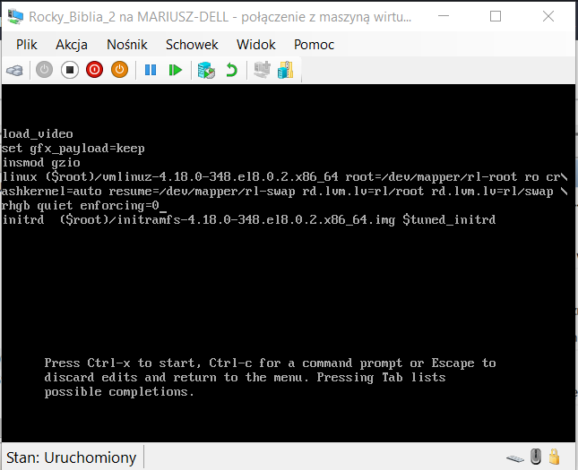
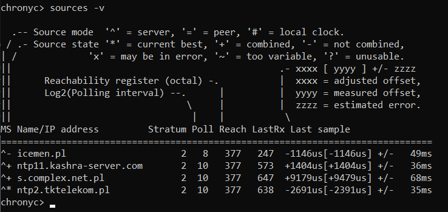

# CLOUDGURU 

# Spis treści

1. [Pomoc](#pomoc)
1. [Przywracanie hasła roota](#Przywracanie-hasła-roota)
1. [Selinux](#selinux)
1. [Wyszukiwanie plików](#Wyszukiwanie-plików) 
1. [Tworzenie użytkowników](#Tworzenie-użytkowników)
1. [Firewall](#firewall)
1. [Kontrola czasu w RHEL](#Kontrola-czasu-w-RHEL)
1. [NFS](#nfs)
1. [LVM](#LVM)
1. [VDO](#vdo)
1. [Logi](#acl)
1. [ACL](#acl)

- [Chlebik](#chlebik)  
- [Cloud Guru](#cg)  

[Koniec](#Koniec)
  
    
# Chlebik

| Zadanko | Notatki | Czy opanowane |
|--|--|--|
| 001_restore_root_password | [Przywracanie hasła roota](#Przywracanie-hasła-roota) | do przećwiczenia, WAŻNE |
| 002_setup_network_parameters |  |  |
| 003_change_hostname |  | razcej tak |
| 004_enable_selinux |  | raczej tak |
| 005_install_apache_and_give_it_permission_to_nfs_resource |  | nie |
| 006_extend_existing_lv_add_label |  | przećwiczyć |
| 007_assign_sel_context_to_the_directory |  | przećwiczyć |
| 008_create_users_with_specified_uid |  | tak |
| 009_allow_other_user_to_get_access_to_home_dir |  | nie |
| 010_dir_ownership_via_group |  | nies |
| 011_create_logical_volume_and_add_filesystem |  | przećwiczyć |
| 012_configure_virtual_console_for_kernel |  | nie |
| 013_create_swap_on_logical_volume |  | przećwiczyć |
| 014_add_entry_to_cron |  | przećwiczyć |
| 015_set_default_system_level |  | tak |
| 016_add_additional_remote_yum_repo |  | nie |
| 017_create_physical_partition_and_mount |  | nie |
| 018_update_kernel_and_make_it_default_one |  | nie |
| 019_create_users_with_secondary_groups |  | przećwiczyć |
| 020_create_folders_with_group_access_rights |  | przećwiczyć |
| 021_configure_ldap_authentication |  | nie |
| 022_configure_autofs |  | nie |
| 023_configure_ntp_on_the_client |  | nie |
| 024_access_rights_for_file |  | przećwiczyć |
| 025_create_whole_lvm_stack |  | nie |
| 026_reduce_the_size_of_lv |  | przećwiczyć |
| 027_create_compressed_archive |  | przećwiczyć |
| 028_search_string_using_grep_and_redirect |  | przećwiyczć |
| 029_make_journald_persistent |  | nie |
| 030_setting_up_vdo |  | nie |
| 031_finding_files |  | przećwiczyć |
| 032_finding_files_with_given_text_in_them |  | przećwiczyć |
| 033_managing_layered_storage |  | nie |
| 034_containers |  | nie |


    
# Pomoc 

## Wyszukiwanie pomocy

- ```apropos``` wyszukuje strony w pomocy, podobnie jak *man -k*
- ```man -k``` - wyszukuje strony w pomocy 
- ```info``` - wyświetla komendy z opisem  
- ```rpm -qd``` - wyświetl pliki z dokumentacją dla danego pakietu
- locate "$szukana_komenda" - powinno wylistować pliki z pomocą 

## Man

- ```man man``` 

## Info

```info``` - **Samo wykonanie polecenia info wyświetla przydatne komendy z opisami**


## /usr/share/doc

Dodatkowa dokumentacja 


# Przywracanie hasła roota

[Spis treści](#spis-tre%C5%9Bci)

You are new System Administrator and from now you are going to handle the system and your main task is Network monitoring, Backup and Restore. But you don't know the root password. Change the root password to redhat and login in default Runlevel.

```console
### In RHEL8
- reboot the system
- press "e" letter
- Add "rd.break" at the end of de line thet begening with "Linux" in grub menu
- ctrl + x

# mount -o remount,rw /sysroot
# chroot /sysroot
# passwd

### SELinux jest rozjechany więc musi ustalić etykiety od nowa ? 
### Inaczej nikt nie będzie mógł zalogować się do systemu
#  touch /.autorelabel
# exit
# logout
```


# Wyszukiwanie plików 

[Spis treści](#spis-tre%C5%9Bci)

## locate 

locate działa na podstawie bazy danych 

locate "$file_name"

updatedb - aktualizuje bazę locate


# Tworzenie użytkowników 
[Spis treści](#spis-tre%C5%9Bci)

# NFS
[Spis treści](#spis-tre%C5%9Bci)

Egzamin : 
- Mount and unmount network file systems using NFS


### Dokumentacja 

- ```man 5 nfs``` - wyświetlenie opcji montowania dla udziałów nfs   
- ```rpm -qd nfs-utils | less``` - wyświetlenie plików z dokumentacją

- ```man mount.nfs``` - opcje montowania udziału nfs   

### #TODO - sprawdzić dokładniej jak to opisać 
- ```nfsmount.conf``` -   
  
- ```man showmount``` - informacje o użyciu polecenia showmount do wyświetlenia katalogów współdzielonych, które są udostępniane przez serwery NFS  


```bash
# Ogólne infomracje na temat pakietu nfs
rpm -qi nfs-utils
# Configi
rpm -qc nfs-utils
# Wylistowanie plików w pakiecie nfs-utils
rpm -ql nfs-utils | grep bin
```   


# Firewall 
[Spis treści](#spis-tre%C5%9Bci)

- W RHEL8 firewall jest zarzadzany przez firewalld, pod spodem jest nftables  
zarzadzanie firewalld odbywa sie za pomoca komendy ```firewall-cmd```

- Pliki konfiguracyjne : 
	- ```/usr/lib/firewalld``` - katalog z domyslna konfiguracja
	- ```/etc/firewalld``` - katalog z obecnie dzialajacym configiem 


- firewall-cmd - odpowiada za konfigurację zapory   
    
    - Zarządzanie firewallem :  
        - ```--state``` - wyswietla czy firewall dziala
        - ```--reload``` - zatwierdzenie wprowadzonych zmian
        - ```--list-all --permanent``` wypisuje reguły które są zapisane w configu - będą działać po ***reboocie systemu***
        
    - Otwieranie portów/usług :  
        - ```--add-port "$port_number"/[tcp | udp ]``` - Otwarcie portu dla tcp lub udp
        - ```--add-service "$service_name"``` - Udostępnienie możliwości komunikacji z usługą (lista dostępna pod tabulatorem)


**ZAWSZE TRZEBA PAMIĘTAĆ O OPCJI ```--permanent```**,  
w przeciwnym wypadku zmiany nie będą stałe   

Otwarcie portu 80 tcp

```console
# firewall-cmd --add-port=80/tcp --permanent
```

Dodanie serwisu mysql do firewalla

```console
# firewall-cmd --add-service=http --permanent
```


Wylistowanie ustawiń **PERMANENTNYCH** dla firewalla

```console
# firewall-cmd --list-all --permanent
```

Przeładowanie configu firewalla 

```console
# firewall-cmd --reload 
```

Sprawdzenie czy port 90 jest otwarty, telnet powinien wyrzucić błąd po czasie jeżeli działa 

```console
# telnet 172.20.183.251 90
```  
  
- ```nmap -A``` - skanuje porty zdalnej maszyny, wyświetla wszystkie informacje      
- ```telnet "$remote_ip" "$remote_port"``` - pozwala sprawdzić czy port jest otwarty   
- ```curl "$remote_ip"``` - pozwala sprawdzić czy działa serwis http      


## Ćwiczenie 

### Otwarcie konkretnego portu na maszynie 

1. Klient - Przeskanowanie serwera na którym działa usługa, sprawdzenie czy ma jakieś otwarte porty

```console
nmap -A "$remote_ip_address"
```

2. SerNa serwerze 


# SELinux

### #TODO - dodać jak rozwiązywać podstawowe błędy

- ```semanage boolean -l``` - **wyświetlenie opisu** wszystkich zmiennych SELinux 

## Tryby SELinux

### Sprawdzanie trybu selinux 
- ```sestatus``` - szczegółowe informacje
- ```getenforce``` - dostajemy tylko tryb w jakim selinux działa obecnie 

    
### Zmiana trybu SELinux
- Tymczasowa zmiana 
    - ```setenforce``` - umożliwia tymczasową zmianę trybu - PO REBOOCIE STOSOWANY JEST TRYB Z CONFIGA    
  
- Stała zmiana SELinux - **zmiany zostają zastosowane po reboocie**  
    - zmiana parametru ```SELINUX=``` w pliku ```/etc/selinux/config``` np. ```SELINUX=enforcing```     
        - **enforcing** - selinux działa w pełni, **blokuje**, zdarzenia blokowane są reportowane   
        - **permissive** - selinux tylko zapisuje blokowane akcje w logach, **nic nie jest blokowane**    
        - **disabled** - nic nie jest blokowane, nic nie jest logowane  

- Zmiana podczas bootowania systemu ( parametry przy odpalaniu systemu)  
    - Dopisanie/zmiana parametru ```enforcing``` np. ```enforcing=0``` w linijce ```linux``` (parametry jądra)  - zmiana parametru selinux przy bootowaniu na   permissive     
  


  
  


**Jeżeli mamy jakiś problem z selinuxem to jest duża szansa że odpowiednią komendę znajdziemy poprzez grep "$nazwa_usługi" /var/log/messages**

## Konteksty SELinux

Dla większości komend aby sprawdzić kontekst działa parametr ```-Z```,   
np. 
- ```ls -laZ``` - sprawdzenie kontekstu plików 
- ```ps -elZ``` - sprawdzenie kontekstu procesów 


### Sprawdzenie kontekstu pliku 

- ```ls -laZ "$file_name"``` - wyświetlenie kontekstu pliku 

**Context** is the one with **_t** suffix - *user_home_dit_t*

```console
# ls -lZ /home

drwx------. chlebik chlebik unconfined_u:object_r:user_home_dir_t:s0 chlebik
```

### Przypisanie kontekstu SELinux

```semanage``` - służy do zarządzania kontekstami 
```semanage fcontext``` - zarządza kontekstami plików i folderów 
```restorecon -R``` - służy do zatwierdzenia zmian na folderach, zmiany etykiet 


```yum whatprovides */semanage``` - domyślnie może nie być zainstalowane  


# Kontrola czasu w RHEL

[Cloud_guru - lekcja](https://learn.acloud.guru/course/red-hat-certified-system-administrator-ex200-exam-prep/learn/60dc10ad-0973-4bb6-8a0b-9d987f2c25f3/071c69c6-90ba-4885-9f32-15949b43286f/watch)


Poprzednim serwerem czasu był ntp, obecnym chrony

- ```chrony``` - serwer lub klient (zależy od potrzeby) kontroli czasu

- ```chronyd``` - **daemon for synchronisation of the system clock**, can be controlled via local or remote instances of ```chronyc```
- ```chronyc``` - command line program **used to monitor and control ```chronyd```** - działa na tej samej zasadzie co fdisk, **tabulator mocno pomaga** 
    - ```help``` - wyświetla pomoc
    - ```sources -v``` - wyświetla dostępne źródła, razem z wyjaśnieniem co znaczą wpisy w tabeli   
      
    - ```sourcestats -v``` - więcej informacji na temat dostępnych serwerów 
    - ```serverstats``` - nie wiem ? 
  
- ```ntpstat``` - wspiera chronyd ? - domyślnie nie jest zainstalowane 


##### Ważne pliki :  

- ```/etc/chrony.conf``` - config  
- ```/etc/chrony.keys``` - zawiera klucze ? 
- ```/usr/share/doc/chrony``` - dokumentacja

## Przykładowe ćwiczenie 

### 1. Synchronizacja czasu (klient z serwerem)


1. instalacja chrony 

```console
# dnf install chrony -y
```

2.  Sprawdzenie statusu chronyd i ewentualne odpalenie 

```console
# systemctl status chronyd
# systemctl enable --now chronyd
```

3. Dodanie docelowego serwera w configu ```/etc/chrony.conf```
There is a list of servers being used to get time from. The lines start with server. In order to use only one of the servers (the one that is provided in question) You should comment all others and just put new line there:
server classroom.example.com iburst
    
```console
# vim ```/etc/chrony.conf```

### server "$sever_address" [option] - składnia opisana w man ```chrony.conf```
server 169.254.169.123 iburst
```

4. Restart usługi chronyd

```console
# systemctl restart chronyd
```


5. Sprawdzenie czy serwer został zsynchronizowany **(bez wymuszenia synchronizacja może zająć trochę czasu)**

```console
# chronyc sources -v
```

6. Wymuszenie synchronizacji 

```console
# chronyc makestep

200 OK
```

6. Display parameters about the system’s clock performance

```console
# chronyc tracking 
```

7. Sprawdzenie czy zegar jest zsynchronizowany 

```console
# timedatectl

               Local time: Wed 2022-03-09 12:28:58 EST
           Universal time: Wed 2022-03-09 17:28:58 UTC
                 RTC time: Wed 2022-03-09 17:28:58
                Time zone: America/New_York (EST, -0500)
--> System clock synchronized: yes <--
              NTP service: active
          RTC in local TZ: no
```


# LVM 

## Ćwiczenie : 
Create a new physical volume with volume group in the name of datacontainer, the extent of VG should be 16MB. Also create new logical volume with name datacopy with the size of 50 extents and filesystem vfat mounted under /datasource.


1. Before any kind of operations on partitions it is good to know what we actually have in the system.

```console
lsblk
```

2. 

# VDO 

[Spis treści](#spis-tre%C5%9Bci)

VDO będzie na egzaminie, ogarnąć co i jak !

[Pytanie dotyczące VDO](https://github.com/mariuszkuswik/rhcsa-practice-questions/blob/master/questions/030_setting_up_vdo.md)
[artykuł jak to działa](https://hobo.house/2018/09/13/using-vdo-on-centos-rhel7-for-storage-efficiency/)


# ACL 

getfacl "$shared_directory" - listuje aclki
setfacl -m u:jill:r-- "$shared_directory" - ustawia uprawnienia 


# CG 

| Zadanko | Rozdział | Notatki | Czy opanowane | Link | Lokalny link |
|--|--|--|--|--|--|
| Zad: Compressing and Decompressing Files in Linux | Using Essential Tools |  |  |  |
| Lab: Accessing Linux Systems Using RHEL 8 |  |  |  |
| Quiz: Understanding and Using Essential Tools on RHEL 8 |  |  |  |  |
| Lab: Creating Simple Shell Scripts | Creating Simple Shell Scripts |  |  |  | 
| Quiz: Creating Simple Shell Scripts | Creating Simple Shell Scripts |  |  |
| Managing the Boot Process on RHEL 8 | Operating Running Systems on RHEL 8  |  |  |
| Zad: Understanding Logging and Using Persistent Journals on RHEL 8 | Operating Running Systems on RHEL 8 |  |  | [Persistent Journals](https://content.acloud.guru/5cd97cc2-306e-480e-934c-1597b4ab5866/1351620000001-000010.mp4?Expires=1647905190&Signature=b3ATruEet/hmVm1GIMdITDHpg7DI4IawzVH63vdAlL6dHVO4BHvgfdmRpNANa90OESfPp6Kc3Tzy8c2oXEVFlaKHqTxGUn0HyTlVGB1FUZfW0mL72Iszy1XwlylpANmBCA5JqdU0mOyQzbx733A1NFb3LBDTJ5x3TYJyB517CDXKEESZwtGemcQ6FYpqP0501KfQ9Y2uVO+UBt5nErQEc1YKsLkph4EZGL79NB4y+CZQEHrVLxhsmjplrflVBrn6IfyHPbuyLErfQQxkkS2WT7tymOoZOmj6IPmeY2hJKLoAiKxJJ1N++NOB+vUWn9N+XBytLPCqQ+ukptrSlpEVEg==&Policy=eyJTdGF0ZW1lbnQiOlt7IlJlc291cmNlIjoiaHR0cHM6Ly9jb250ZW50LmFjbG91ZC5ndXJ1LzVjZDk3Y2MyLTMwNmUtNDgwZS05MzRjLTE1OTdiNGFiNTg2Ni8qIiwiQ29uZGl0aW9uIjp7IkRhdGVMZXNzVGhhbiI6eyJBV1M6RXBvY2hUaW1lIjoxNjQ3OTA1MTkwfX19XX0=&Key-Pair-Id=APKAISLU6JPYU7SF6EUA) | [Persistent Journals lokalny](#Understanding-Logging-and-Using-Persistent-Journals-on-RHEL-8) | 
| Zad: Managing Individual Linux Processes |  Operating Running Systems on RHEL 8 |  |  |
| Managing Tuned Profiles on RHEL 8 | Zad | Operating Running Systems on RHEL 8 |  |  
| Managing the Boot Process on RHEL 8 | Zad | Operating Running Systems on RHEL 8 |  |  
| Managing Processes and Tuned Profiles on RHEL 8 | Zad | Operating Running Systems on RHEL 8 |  |  
| Working with Log Files and Journals on RHEL 8 | Zad | Operating Running Systems on RHEL 8 |  |  
| Quiz: Operating Running Systems on RHEL 8 | Quiz | Operating Running Systems on RHEL 8 |  |  
|--|--|--|--|--|
| Manipulating Disk Partitions in Linux | Zad | Configuring Local Storage on RHEL 8 |  |  
|  |  |  |  |  
| Working with Log Files and Journals on RHEL 8 |  |  |  | |  
|  |  |  |  |


# Logi 
## Understanding Logging and Using Persistent Journals on RHEL 8

```grep "$nazwa_szukanej_usługi" `find /var/log -maxdepth 1 -type f` | less ``` - Dobrze jest grepować logi w /var/log, w ten sposób dowiemy się które pliki zawierają logi o nazej usłudze


- ```journalctl``` - dziennik zdarzeń dla **systemd**, standardowo resetowany przy reboocie
    - ```journalctl -k``` - Wyświetla komunikaty tylko **na temat jądra**   `
    - ```journalctl -u nazwa_usługi``` - Wyświetlenie komunikatów **dotyczących określonej usługi**:   

    ```console
    journalctl -u NetworkManager.service
    journalctl -u httpd.service
    journalctl -u avahi-daemon.service
    ```

- ```/var/log/messages```

### #TODO - opisać jakoś 

## Ustawienie stałego journalctl 

```/etc/systemd/journald.conf```
```man journalctl.conf``` - pomoc dla pliku 

Zmieniamy zmienną ```Storage```

```Storage=persistent``` - powoduje, że odpowiedni katalog jest tworzony w razie potrzeby
```Storage=auto``` - logi będą zapisywane tylko jeżeli katalog istniał wcześniej 

```bash
[Journal]
#Storage=auto
#Compress=yes
#Seal=yes
#SplitMode=uid
#SyncIntervalSec=5m
#RateLimitIntervalSec=30s
#RateLimitBurst=10000
```


# Rozwiązywanie problemów (ogólnie)

## httpd

1. Sprawdzenie czy usługa działa, jeżeli tak/nie to czy systemd pokazuje jakieś błędy 
2. Pobranie strony ```curlem``` z podanego serwera
3. sprawdzenie logów systemd - ```journalctl -u httpd``` - pobranie logów dla konkretnej usługi
4. sprawdzenie loga audit - ```grep /var/log/audit/audit.log``` - sprawdzić co to jest konkretnie za log, jest od niego demon ```auditd```
5. sprawdzenie logów - ```grep /var/log/messages``` 
3. Ustawienie selinux w tryb permissive 
4. Włączenie odpowiedniej zmiennej boolowskiej ?


### Koniec

[Spis treści](#spis-tre%C5%9Bci)