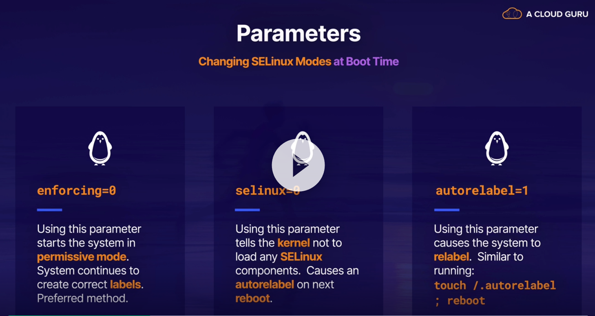

# CLOUDGURU 

1. [Pomoc](#cg-pomoc)
1. [Firewall](#cg-firewall)
1. [Selinux](#cg-selinux)

# CG-Pomoc 

## Wyszukiwanie pomocy

- ```apropos``` wyszukuje strony w pomocy, podobnie jak *man -k*
- ```man -k``` - wyszukuje strony w pomocy 
- ```info``` - wyświetla komendy z opisem  

## Man

- ```man man``` 

## Info

```info``` - **Samo wykonanie polecenia info wyświetla przydatne komendy z opisami**


## /usr/share/doc

Dodatkowa dokumentacja 


# CG-Firewall 


- firewall-cmd - odpowiada za konfigurację zapory 
    - ```--reload``` - zatwierdzenie wprowadzonych zmian
    - ```--check-config``` - sprawdza czy w configu nie ma błędów  
    - ```--list-all``` - List everything added or enabled
    - ```--list-services``` - listuje serwisy dodane do firewalla 
    - --list-ports - 
    - --add-service - 
    - --add-port - 

```nmap``` - pozwala skanować porty zdalnej maszyny 

## Ćwiczenie 

### Otwarcie konkretnego portu na maszynie 

1. Klient - Przeskanowanie serwera na którym działa usługa, sprawdzenie czy ma jakieś otwarte porty

```console
nmap -A "$remote_ip_address"
```

2. SerNa serwerze 


# CG-SELinux 

- ```semanage boolean -l``` - **wyświetlenie opisu** wszystkich zmiennych SELinux 

### Sprawdzanie trybu selinux 
- ```sestatus``` - szczegółowe informacje
- ```getenforce``` - dostajemy tylko tryb w jakim selinux działa obecnie 

    
### Zmiana trybu SELinux
- Tymczasowa zmiana 
    - ```setenforce``` - umożliwia tymczasową zmianę trybu - PO REBOOCIE STOSOWANY JEST TRYB Z CONFIGA    
  
- Stała zmiana SELinux - **zmiany zostają zastosowane po reboocie**  
    - zmiana parametru ```SELINUX=``` w pliku ```/etc/selinux/config``` np. ```SELINUX=enforcing```     
        - **enforcing** - selinux działa w pełni, **blokuje**, zdarzenia blokowane są reportowane   
        - **permissive** - selinux tylko zapisuje blokowane akcje w logach, **nic nie jest blokowane**    
        - **disabled** - nic nie jest blokowane, nic nie jest logowane  

- Zmiana podczas bootowania systemu ( parametry przy odpalaniu systemu)  
    - Dopisanie/zmiana parametru ```enforcing``` np. ```enforcing=0``` w linijce ```linux``` (parametry jądra)  - zmiana parametru selinux przy bootowaniu na   permissive     
  


  
  


**Jeżeli mamy jakiś problem z selinuxem to jest duża szansa że odpowiednią komendę znajdziemy poprzez grep "$nazwa_usługi" /var/log/messages**

### Konteksty SELinux

Dla większości komend aby sprawdzić kontekst działa parametr ```-Z```,   
np. 
- ```ls -laZ``` - sprawdzenie kontekstu plików 
- ```ps -elZ``` - sprawdzenie kontekstu procesów 

#### Sprawdzenie kontekstu pliku 

- ```ls -laZ "$file_name"``` - wyświetlenie kontekstu pliku 


# Kontrola czasu w RHEL

[Cloud_guru - lekcja](https://learn.acloud.guru/course/red-hat-certified-system-administrator-ex200-exam-prep/learn/60dc10ad-0973-4bb6-8a0b-9d987f2c25f3/071c69c6-90ba-4885-9f32-15949b43286f/watch)


Poprzednim serwerem czasu był ntp, obecnym chrony

- ```chrony``` - serwer lub klient (zależy od potrzeby) kontroli czasu

- ```chronyd``` - **daemon for synchronisation of the system clock**, can be controlled via local or remote instances of ```chronyc```
- ```chronyc``` - command line program **used to monitor and control ```chronyd```** - działa na tej samej zasadzie co fdisk, **tabulator mocno pomaga** 
    - ```help``` - wyświetla pomoc
    - ```sources -v``` - wyświetla dostępne źródła, razem z wyjaśnieniem co znaczą wpisy w tabeli   
      
    - ```sourcestats -v``` - więcej informacji na temat dostępnych serwerów 
    - ```serverstats``` - nie wiem ? 
  
- ```ntpstat``` - wspiera chronyd ? - domyślnie nie jest zainstalowane 


##### Ważne pliki :  

- ```/etc/chrony.conf``` - config  
- ```/etc/chrony.keys``` - zawiera klucze ? 
- ```/usr/share/doc/chrony``` - dokumentacja

## Przykładowe ćwiczenie 

### 1. Synchronizacja czasu (klient z serwerem)


1. instalacja chrony 

```console
# dnf install chrony -y
```

2.  Sprawdzenie statusu chronyd i ewentualne odpalenie 

```console
# systemctl status chronyd
# systemctl enable --now chronyd
```

3. Dodanie docelowego serwera w configu ```/etc/chrony.conf```
There is a list of servers being used to get time from. The lines start with server. In order to use only one of the servers (the one that is provided in question) You should comment all others and just put new line there:
server classroom.example.com iburst
    
```console
# vim ```/etc/chrony.conf```

### server "$sever_address" [option] - składnia opisana w man ```chrony.conf```
server 169.254.169.123 iburst
```

4. Restart usługi chronyd

```console
# systemctl restart chronyd
```


5. Sprawdzenie czy serwer został zsynchronizowany **(bez wymuszenia synchronizacja może zająć trochę czasu)**

```console
# chronyc sources -v
```

6. Wymuszenie synchronizacji 

```console
# chronyc makestep

200 OK
```

6. Display parameters about the system’s clock performance

```console
# chronyc tracking 
```

7. Sprawdzenie czy zegar jest zsynchronizowany 

```console
# timedatectl

               Local time: Wed 2022-03-09 12:28:58 EST
           Universal time: Wed 2022-03-09 17:28:58 UTC
                 RTC time: Wed 2022-03-09 17:28:58
                Time zone: America/New_York (EST, -0500)
--> System clock synchronized: yes <--
              NTP service: active
          RTC in local TZ: no
```


# CG-LVM 

## Ćwiczenie : 
Create a new physical volume with volume group in the name of datacontainer, the extent of VG should be 16MB. Also create new logical volume with name datacopy with the size of 50 extents and filesystem vfat mounted under /datasource.


1. Before any kind of operations on partitions it is good to know what we actually have in the system.

```console
lsblk
```

2. 

# CG-VDO 

VDO będzie na egzaminie, ogarnąć co i jak !

[Pytanie dotyczące VDO](https://github.com/mariuszkuswik/rhcsa-practice-questions/blob/master/questions/030_setting_up_vdo.md)
[artykuł jak to działa](https://hobo.house/2018/09/13/using-vdo-on-centos-rhel7-for-storage-efficiency/)


# Rozwiązywanie problemów (ogólnie)

## httpd

1. Sprawdzenie czy usługa działa, jeżeli tak/nie to czy systemd pokazuje jakieś błędy 
2. Pobranie strony ```curlem``` z podanego serwera
3. sprawdzenie logów systemd - ```journalctl -u httpd``` - pobranie logów dla konkretnej usługi
4. sprawdzenie loga audit - ```grep /var/log/audit/audit.log``` - sprawdzić co to jest konkretnie za log, jest od niego demon ```auditd```
5. sprawdzenie logów - ```grep /var/log/messages``` 
3. Ustawienie selinux w tryb permissive 
4. Włączenie odpowiedniej zmiennej boolowskiej ?


# Koniec CLOUDGURU 