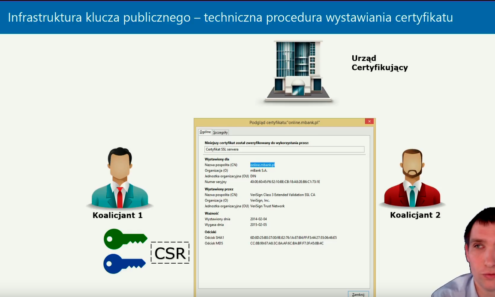

# Spis odcinków 
## Youtube
- [Playlista](https://youtu.be/nVVoehDwJDY?si=z9MWETbQ4m8muJDB)

---

- [Logika działania PGP/GPG oraz PKI. Infrastruktura klucza publicznego](https://www.youtube.com/watch?v=nVVoehDwJDY&list=PLc0fm8idNdk6kr3svhMCnJ4r2881rh_hx)
- []()

## Google drive

# Pierwszy odcinek - Logika działania PGP/GPG oraz PKI. Infrastruktura klucza publicznego
- [Logika działania PGP/GPG oraz PKI. Infrastruktura klucza publicznego](https://www.youtube.com/watch?v=nVVoehDwJDY&list=PLc0fm8idNdk6kr3svhMCnJ4r2881rh_hx)

### Klucz asymetryczny - przypomnienie problemu bezpieczeństwa przesłania klucza publicznego  
Systemy kryptografii asymetrycznej wykorzystują dwa klucze: **publiczny**, który można udostępniać, i **prywatny**, który musi pozostać tajny. Problemem jest weryfikacja, czy klucz publiczny rzeczywiście należy do deklarowanego właściciela. Atakujący może przechwycić komunikację i podmienić klucz publiczny, co pozwoli mu podszywać się pod właściciela i odszyfrowywać dane. Rozwiązaniem są mechanizmy weryfikacji zaufania do klucza publicznego.


### Metody rozwiązania problemu zaufania do klucza publicznego  
#### Lista CRL  
CRL (Certificate Revocation List) to lista unieważnionych certyfikatów cyfrowych publikowana przez urząd certyfikacji (CA). Certyfikaty mogą być unieważnione z różnych powodów, takich jak kompromitacja klucza prywatnego lub błędne dane.  
Przykład wizualizacji zasad związanych z zaufaniem do kluczy publicznych znajduje się poniżej:  
  

#### Certyfikaty cyfrowe  
Certyfikaty cyfrowe są podpisywane przez urząd certyfikacji, co zapewnia, że klucz publiczny należy do konkretnego podmiotu.  

#### Web of Trust  
Zdecentralizowane rozwiązanie, w którym użytkownicy wzajemnie podpisują swoje klucze publiczne, tworząc sieć zaufania. Przykładem jest system PGP/GPG.

#### Infrastruktura klucza publicznego (PKI)  
Centralny model zarządzania kluczami, oparty na hierarchii urzędów certyfikacji.

### Logika działania PGP/GPG  
PGP (Pretty Good Privacy) i GPG (GNU Privacy Guard) zapewniają szyfrowanie, weryfikację integralności danych oraz podpisy cyfrowe. Kluczowe cechy:  
1. **Web of Trust**: Zdecentralizowane budowanie zaufania między użytkownikami przez podpisywanie kluczy.  
2. **Szyfrowanie hybrydowe**: Łączenie szyfrowania asymetrycznego i symetrycznego dla wydajności i bezpieczeństwa.  
3. **Podpisy cyfrowe**: Potwierdzają tożsamość nadawcy i zapewniają integralność danych.

### Logika działania Infrastruktury klucza publicznego  
PKI to hierarchiczny system zarządzania kluczami publicznymi i certyfikatami cyfrowymi. W jego skład wchodzą:  
- **Urząd certyfikacji (CA)**: Wystawia certyfikaty potwierdzające autentyczność kluczy publicznych.  
- **Urząd rejestracji (RA)**: Weryfikuje tożsamość podmiotów przed wydaniem certyfikatu.  
- **Lista CRL**: Zawiera certyfikaty, które zostały unieważnione.  
- **Repozytorium certyfikatów**: Przechowuje wydane certyfikaty, umożliwiając ich weryfikację.


### Warunki "zaufania" dla certyfikatu  
Certyfikat cyfrowy jest uznawany za zaufany, jeśli:  
1. Jest podpisany przez zaufany urząd certyfikacji (CA).  
   - W systemie **Windows** lista zaufanych urzędów certyfikacji znajduje się w magazynie certyfikatów:  
       
   - W systemie **Ubuntu** zaufane urzędy znajdują się w katalogu `/etc/ssl/certs`:  
       
2. Certyfikat nie znajduje się na liście CRL i jest wciąż ważny.  
3. Jego integralność nie została naruszona – dowodem jest poprawny podpis cyfrowy CA.  

### Techniczna procedura wystawiania certyfikatu przez urząd certyfikujący  
1. **Generowanie CSR (Certificate Signing Request)**  
   CSR to plik zawierający klucz publiczny i dane identyfikacyjne. Generuje go właściciel klucza, aby nie ujawniać klucza prywatnego. Przykład polecenia:  
   ```bash
   openssl req -new -key private.key -out request.csr
   ```  
   **Ważne**: CSR **zawsze generujemy sami**, ponieważ jeśli zrobi to ktoś inny, istnieje ryzyko przejęcia naszego klucza prywatnego:  
     
2. **Weryfikacja CSR przez RA**: Urząd rejestrujący (RA) sprawdza tożsamość wnioskodawcy.  
3. **Podpisanie certyfikatu przez CA**: Klucz publiczny i dane z CSR są podpisywane kluczem prywatnym CA.  
4. **Publikacja certyfikatu**: Gotowy certyfikat trafia do repozytorium, aby inni mogli go weryfikować.

### Certyfikaty SSL  
Certyfikaty SSL/TLS są wykorzystywane do zabezpieczenia połączeń internetowych (np. HTTPS). Składają się z:  
- **Klucza publicznego** do szyfrowania sesji.  
- **Danych właściciela**, takich jak nazwa domeny i dane organizacji.  
- **Podpisu CA**, potwierdzającego autentyczność.  

Certyfikaty SSL/TLS są kluczowe dla zapewnienia bezpiecznej komunikacji w Internecie:  

